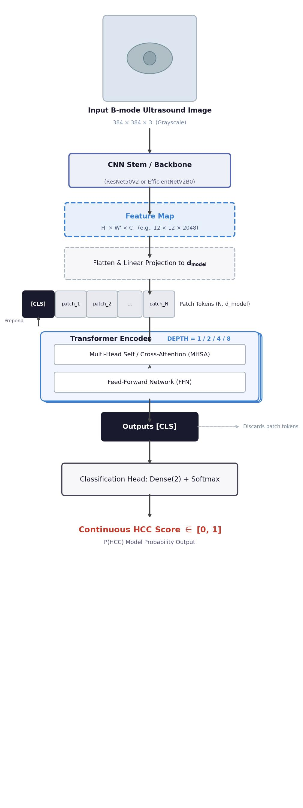

# HCC vs Hemangioma: Dual-Output Imaging Marker on B-mode Ultrasound

> **Development of a Novel Dual-Output Imaging Marker for Quantifying HCC-Likeness on B-mode Abdominal Ultrasound: Complementary Clinical Roles of HCC Cosine Score and Confidence Score**

[](https://www.python.org/) [](https://tensorflow.org/) [](LICENSE)

---

## Overview

This repository contains the full implementation of a **hybrid vision transformer** that differentiates hepatocellular carcinoma (HCC) from hepatic hemangioma on B-mode abdominal ultrasound images, and proposes a **dual-output imaging marker system** — the **HCC Cosine Score** and **Δscore** — as a complement to the conventional single softmax output (Confidence Score).

The core contribution lies not in classification performance alone, but in providing a **continuous, similarity-based imaging marker** that corresponds to the clinician's prototype-comparison reasoning process.

---

## Background & Motivation

B-mode ultrasound is the primary surveillance tool for HCC, yet its early-detection sensitivity remains ~47% (63% with AFP) [[Tzartzeva 2018]](https://doi.org/10.1053/j.gastro.2018.01.064). Conventional deep learning classifiers produce a single softmax output, which:

- Does **not** reflect calibrated posterior probability [[Guo 2017]](https://arxiv.org/abs/1706.04599)
- Cannot quantify whether a lesion sits in the **core or periphery** of the HCC embedding cluster
- Fails to capture the **intraclass heterogeneity** of both HCC (10–15% atypical appearance) and hemangioma (atypical patterns mimicking malignancy)

By contrast, clinicians perform **similarity-based reasoning** — asking "how much does this lesion resemble a typical HCC?" — analogous to the LI-RADS tiered risk stratification system. This study operationalizes that reasoning with geometric cosine similarity in the embedding space.

---

## Dataset

This study uses the **SMC-LUD (Samsung Medical Center – Liver Ultrasound Dataset)** [[Tak et al. 2026]](https://doi.org/10.1038/s41597-026-07023-7), a publicly available large-scale B-mode liver ultrasound dataset.

| Split | Hemangioma | HCC | Total |
|-------|-----------|-----|-------|
| Train | 886 | 972 | 1,858 |
| Validation | 253 | 277 | 530 |
| Test | 128 | 140 | 268 |
| **Total (Clean)** | **1,267** | **1,389** | **2,656** |

- **Patient-level split** applied to prevent data leakage between development and evaluation sets
- Clean subset (no caliper artifacts): 744 patients, 2,656 images
- Full dataset: 1,021 patients, 5,385 images (HCC: 2,716 images, Hemangioma: 2,669 images)

### Patient Demographics

| Characteristic | HCC (n=600 pts) | Hemangioma (n=421 pts) |
|---|---|---|
| Age, mean ± SD (range), yr | 66.65 ± 11.02 (20–90) | 55.50 ± 12.76 (30–90) |
| Male, n (%) | 491 (81.8%) | 174 (41.3%) |
| Female, n (%) | 109 (18.2%) | 247 (58.7%) |
| Lesion size (max diameter), median / Q1 / Q3, cm | 2.90 / 2.10 / 4.50 | — |

---

## Model Architecture

The proposed model is a **CNN–Transformer hybrid** architecture:

- **CNN Backbone**: EfficientNetV2B0 (7.1M parameters)
- Feature maps reshaped into patch tokens and fed into a **Transformer Encoder**
- A **CLS token** representation yields the final embedding vector
- **Dual-output heads**: Confidence Score (softmax) + Cosine Similarity Scores (HCC Cosine Score, Δscore)



*Figure: Hybrid Vision Transformer architecture. EfficientNetV2B0 extracts local CNN features, which are processed by a Transformer encoder. The CLS token embedding is used to derive both the confidence score and cosine-based imaging markers.*

---

## Training Strategy & Ablation

Six conditions were compared (2 backbones × 3 training modes):

| # | Backbone | Training Mode | Val AUROC | Val Sens (%) | Val Spec (%) | F1 |
|---|----------|--------------|:---------:|:------------:|:------------:|:---:|
| 1 | ResNet50V2 | CE Only | 1.0000 | 100.00 | 100.00 | 1.0000 |
| 2 | EfficientNetV2B0 | CE Only | 1.0000 | 100.00 | 99.60 | 0.9980 |
| 3 | ResNet50V2 | CE + SupCon | 1.0000 | 99.64 | 100.00 | 0.9982 |
| **4** | **EfficientNetV2B0** | **CE + SupCon** | **1.0000** | **99.64** | **100.00** | **0.9982** |
| 5 | ResNet50V2 | NNCLR (2-stage) | 0.9990 | 99.64 | 99.21 | 0.9945 |
| 6 | EfficientNetV2B0 | NNCLR (2-stage) | 0.9990 | 98.19 | 98.42 | 0.9840 |

**Bold = Primary Model (#4)**. CE = Cross-Entropy; SupCon = Supervised Contrastive Learning; NNCLR = 2-stage pipeline (NNCLR SSL pre-training → CE+SupCon fine-tuning).

### Key Ablation Findings

- **CE + SupCon ≥ CE Only** in embedding alignment quality, with equivalent classification performance
- **EfficientNetV2B0 (7.1M) ≈ ResNet50V2 (23.6M)** in AUROC — lighter model preferred for clinical deployment
- **NNCLR 2-stage pipeline** consistently underperformed CE+SupCon alone, providing **no justification** for the additional computational cost in this dataset size

---

## Dual-Output Imaging Marker System

### Definitions

| Output | Definition | Clinical Meaning |
|--------|-----------|------------------|
| **Confidence Score** | HCC softmax value | Model decision strength (not calibrated probability) |
| **HCC Cosine Score** | Cosine similarity between lesion embedding and HCC prototype cluster (k=4) | Quantified similarity to "typical HCC" appearance |
| **Hemangioma Cosine Score** | Cosine similarity to hemangioma prototype cluster (k=4) | Quantified similarity to "typical hemangioma" |
| **Δscore** | HCC Cosine Score − Hemangioma Cosine Score | Relative discriminative margin between two competing classes |

The **SupCon loss** forces intra-class compactness in the embedding space:

$$\mathcal{L}_{SupCon} = \sum_{i} \frac{-1}{|P(i)|} \sum_{p \in P(i)} \log \frac{\exp(z_i \cdot z_p / \tau)}{\sum_{a \in A(i)} \exp(z_i \cdot z_a / \tau)}$$

This ensures that cosine distances in embedding space meaningfully reflect clinical similarity — a prerequisite for valid cosine-based imaging markers.

---

## Results

### Primary Model Performance (EfficientNetV2B0 + CE+SupCon)

| Metric | Validation Set | Test Set |
|--------|:--------------:|:--------:|
| AUROC | **1.000** | **1.000** |
| Accuracy (%) | 100.00 | 99.63 |
| Sensitivity (%) | 99.64 | 100.00 |
| Specificity (%) | 100.00 | 99.22 |
| PPV (%) | 100.00 | 99.29 |
| NPV (%) | 99.61 | 100.00 |
| F1 Score | 0.9982 | 0.9964 |
| TP / FP / FN / TN | 277 / 0 / 0 / 253 | 140 / 1 / 0 / 127 |

*Val n=530 (HCC 277, Hemangioma 253); Test n=268 (HCC 140, Hemangioma 128). Cutoff (Youden's J on Val): 0.0011.*

### Three-Way ROC Comparison (Non-inferiority Validation)

| Output | Score Type | Prototype | AUROC (Val) | AUROC (Test) | DeLong p |
|--------|-----------|-----------|:-----------:|:------------:|:--------:|
| ROC-A | Confidence Score | — | 1.000 | 1.000 | — (ref) |
| ROC-B | HCC Cosine Score | mean | 1.000 | 1.000 | 1.000 (ns) |
| ROC-C | Δscore | mean | 1.000 | 1.000 | 1.000 (ns) |
| ROC-B | HCC Cosine Score | k-means (k=4) | 1.000 | 1.000 | 1.000 (ns) |
| ROC-C | Δscore | k-means (k=4) | 1.000 | 1.000 | 1.000 (ns) |

*ns: not significant (p>0.05). Cosine-based markers are **non-inferior** to Confidence Score.*

### Cross-Model AUROC Summary (Test Set)

| Model | Training | Conf. (A) | Cosine-B (mean) | Δscore-C (mean) | DeLong p (A vs B) |
|-------|----------|:---------:|:---------------:|:---------------:|:-----------------:|
| EfficientNet | CE Only | 1.000 | 1.000 | 1.000 | 1.000 (ns) |
| **EfficientNet** | **CE+SupCon** | **1.000** | **1.000** | **1.000** | **1.000 (ns)** |
| EfficientNet | NNCLR | 1.000 | 0.893 | 1.000 | < 0.001 |
| ResNet | CE Only | 1.000 | 1.000 | 1.000 | 1.000 (ns) |
| ResNet | CE+SupCon | 1.000 | 1.000 | 1.000 | 1.000 (ns) |
| ResNet | NNCLR | 0.999 | 0.068 | 0.989 | < 0.001 |

---

## Figures

### Figure 1 — t-SNE Embedding Space Visualization (Primary Model)


*t-SNE visualization of the embedding space (EfficientNetV2B0 + CE+SupCon, test set). HCC (orange) and Hemangioma (blue) clusters are clearly separated. SupCon-induced intra-class compactness is confirmed.*

### Figure 2 — Confusion Matrices (Test Set, Three Outputs)

| Fig 2-A: Confidence Score | Fig 2-B: HCC Cosine Score | Fig 2-C: Δscore |
|:---:|:---:|:---:|
|  |  |  |

*All three outputs achieve FN=0 (no missed HCC) with FP=1 each on the test set.*

### Figure 3 — Triple ROC Curves (Primary Model)

| Fig 3-A: Validation Set | Fig 3-B: Test Set |
|:---:|:---:|
|  |  |

*ROC-A (Confidence), ROC-B (HCC Cosine, mean prototype), and ROC-C (Δscore) overlap completely at AUROC=1.000. DeLong test: all p=1.000.*

### Figure 4 — ROC Curve Overlay


*Multi-model ROC curve comparison. CE+SupCon models maintain AUROC=1.000 across all three output types.*

### Figure 5 — HCC Cosine Score Distribution (True HCC Cases)


*Boxplot of HCC Cosine Score in true HCC cases (Val+Test combined, n=381) by backbone and training mode. CE+SupCon yields significantly higher HCC cosine scores than CE Only for both backbones (all p < 0.001 by independent-samples t-test), confirming SupCon's role in aligning HCC embeddings toward the HCC prototype.*

### Figure 6 — Δscore Distribution (True HCC Cases)


*Δscore distribution in true HCC cases. Unlike HCC Cosine Score, Δscore shows no statistically significant difference between CE Only and CE+SupCon (EfficientNetV2B0: p=0.902, ResNet50V2: p=0.625), suggesting that the shared ultrasound modality characteristics affect both HCC and hemangioma prototypes equally.*

### Figure 7 — Dual-Output Scatter Plot (Confidence vs Δscore)

| Fig 7-A | Fig 7-B |
|:---:|:---:|
|  |  |

*Dual-output scatter plot of Confidence Score vs Δscore. Cases near the decision boundary in confidence score (0.4–0.6) can be correctly identified by Δscore, demonstrating the salvage effect of cosine-based markers.*

---

## Key Finding: Ambiguous Confidence Salvage Effect

For lesions with Confidence Score in the **ambiguous range (0.4–0.6)**:

| Classifier | Ambiguous HCC Cases | Correct | Accuracy |
|---|---|---|---|
| Classification-only (CE) | 7 | 3 | **42.86%** |
| **CE+SupCon + Cosine Rescue** | 5 | 5 | **100%** |

When the softmax output hesitates near the decision boundary, **HCC Cosine Score and Δscore correctly identify all ambiguous HCC cases** (TP=5, FN=0). This demonstrates the complementary clinical value of the dual-output system.

---

## Why SupCon is Essential

The critical insight is that **SupCon training restructures the embedding space** in a way that makes cosine distances clinically meaningful:

- **CE Only**: Embedding geometry is an incidental byproduct of classification boundary formation
- **CE + SupCon**: Embedding space is explicitly optimized for intra-class compactness and inter-class separability, making cosine similarity a valid proxy for clinical prototype-comparison reasoning

Without SupCon, cosine-based markers may be statistically valid (AUROC ~1.000 for Δscore) but lack the **radiologic interpretability** that justifies their clinical use.

---

## Why SSL Pre-training (NNCLR) Fails Here

The 2-stage NNCLR pipeline (SSL pre-training → CE+SupCon fine-tuning) consistently **underperformed** CE+SupCon alone:

- NNCLR mean-prototype HCC Cosine Score collapsed to AUROC **0.068** (ResNet) — near-random
- Classification AUROC: 0.985–0.999 vs. **1.000** for CE+SupCon
- SSL pre-training provides **no performance gain** at this dataset scale (~2,656 images)

**Conclusion**: For labeled medical image datasets of this size, direct supervised training with CE+SupCon is more efficient and effective than SSL pre-training pipelines.

---

## Repository Structure

```
hcc-vs-hemangioma/
├── Stage1_SSK_run.ipynb              # Stage 1: NNCLR SSL pre-training
├── Stage2_Classification_Benchmark.ipynb  # Stage 2: CE/CE+SupCon classification
├── VICReg_ConvHybrid_run.ipynb       # VICReg-based SSL experiments
├── NNCLR_ConvHybrid_run.ipynb        # NNCLR-based SSL experiments
├── full_training_notebook.ipynb      # Full training pipeline
├── classification_with_supcon.ipynb  # SupCon classification notebook
├── dataloader.py                     # Dataset loader with patient-level split
├── ambiguous_case_analysis.py        # Ambiguous confidence zone analysis
├── misclassified_rescue_analysis.py  # Misclassification rescue analysis
├── models/                           # Model architecture definitions
├── training/                         # Training utilities and callbacks
├── validation/                       # Validation and evaluation scripts
├── visualization/                    # t-SNE, ROC, confusion matrix plots
├── cosine_probe_result/              # Cosine probe results per model condition
├── figures/                          # Key result figures
│   ├── fig_roc_curve.jpg
│   ├── fig_tsne_embeddings.jpg
│   └── model_architecture.jpg
├── paper_submission/                 # Manuscript and submission materials
│   ├── manuscript.docx
│   ├── fig 1 TSNE visualization.png
│   ├── fig 2-A~C Confusion matrix-*.png
│   ├── fig 3-A, 3-B.png
│   ├── fig 4.png ~ fig 7-B.png
│   └── figures/                      # JPG versions of submission figures
└── paper_outline_medical_journal.md  # Full paper outline (Korean)
```

---

## Methods Summary

### Threshold Determination (No Data Leakage)

All operating thresholds were determined **exclusively on the validation set** using Youden's J statistic (maximizing sensitivity + specificity − 1), then applied **unchanged** to the test set.

| Output | Cutoff (Youden's J, Val) |
|--------|:------------------------:|
| ROC-A (Confidence Score) | 0.0011 |
| ROC-B (HCC Cosine, mean) | −0.0048 |
| ROC-C (Δscore, mean) | −0.9585 |

### Statistical Analysis

- **Discrimination**: AUROC with DeLong 95% CI
- **Three-way ROC comparison**: DeLong pairwise test (p>0.05 → non-inferiority)
- **SupCon effect on score distribution**: Independent-samples t-test on true HCC cases (Val+Test, n=381)
- Threshold-dependent metrics: Sensitivity, Specificity, PPV, NPV, F1, Confusion Matrix

---

## Citation

If you use this code or findings, please cite:

```bibtex
@article{kim2026hcc_cosine,
  title   = {Development of a Novel Dual-Output Imaging Marker for Quantifying 
             HCC-Likeness on B-mode Abdominal Ultrasound: Complementary Clinical 
             Roles of HCC Cosine Score and Confidence Score},
  author  = {Kim, Hyun Soo},
  year    = {2026},
  note    = {Manuscript in preparation}
}
```

### Dataset Citation

```bibtex
@article{tak2026smclud,
  title   = {SMC-LUD: Large-Scale B-Mode Liver Ultrasound Dataset for 
             Hepatocellular Carcinoma and Hemangioma Classification},
  author  = {Tak, Jongwon and Ko, Ryoung-Eun and Kwon, Ryung-Dae and others},
  journal = {Scientific Data},
  volume  = {13},
  pages   = {649},
  year    = {2026},
  doi     = {10.1038/s41597-026-07023-7}
}
```

---

## Key References

1. Tzartzeva K, et al. *Gastroenterology.* 2018. [DOI](https://doi.org/10.1053/j.gastro.2018.01.064) — Ultrasound surveillance sensitivity meta-analysis
2. Yang Q, et al. *EBioMedicine.* 2020. [DOI](https://doi.org/10.1016/j.ebiom.2020.102777) — Deep learning for focal liver lesions (AUROC 0.924)
3. Khosla P, et al. *NeurIPS.* 2020. [arXiv](https://arxiv.org/abs/2004.11362) — Supervised Contrastive Learning
4. Guo C, et al. *ICML.* 2017. [arXiv](https://arxiv.org/abs/1706.04599) — Neural network calibration
5. Tan M & Le QV. *ICML.* 2021. [arXiv](https://arxiv.org/abs/2104.00298) — EfficientNetV2
6. Dosovitskiy A, et al. *ICLR.* 2021. [arXiv](https://arxiv.org/abs/2010.11929) — Vision Transformer (ViT)
7. Du Z, et al. *eClinicalMedicine.* 2025. [DOI](https://doi.org/10.1016/j.eclinm.2025.103098) — Multicentre HCC ultrasound AI validation
8. Minami Y, et al. *Liver Cancer.* 2023. [DOI](https://doi.org/10.1159/000528538) — Atypical HCC imaging and AI

---

## License

MIT License. See [LICENSE](LICENSE) for details.

---

*Target Journal: SCIE Q1–Q2 (PubMed-indexed) — e.g., Ultrasonics, Diagnostics, Frontiers in Oncology, JMIR Medical Informatics*
