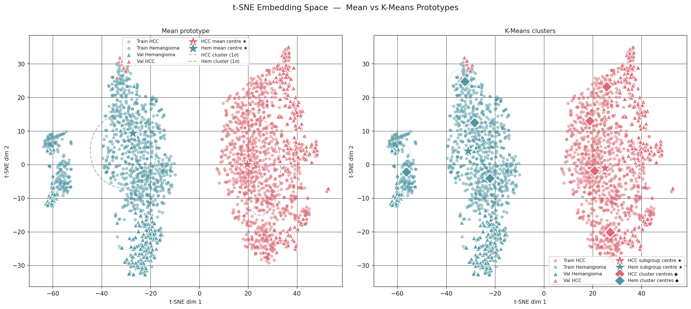
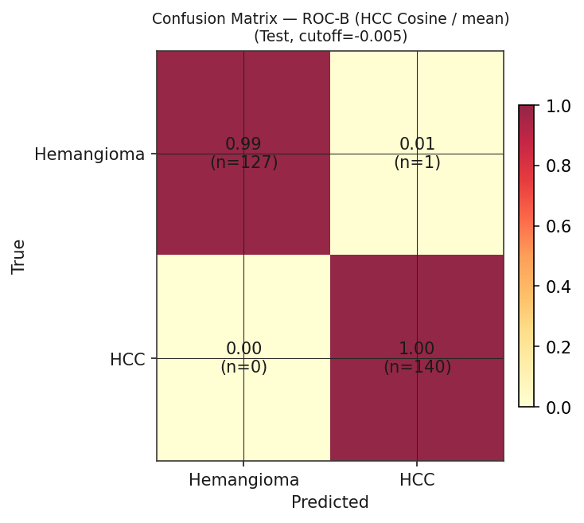
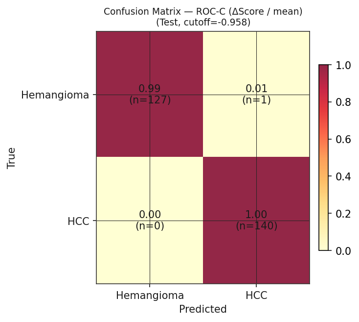
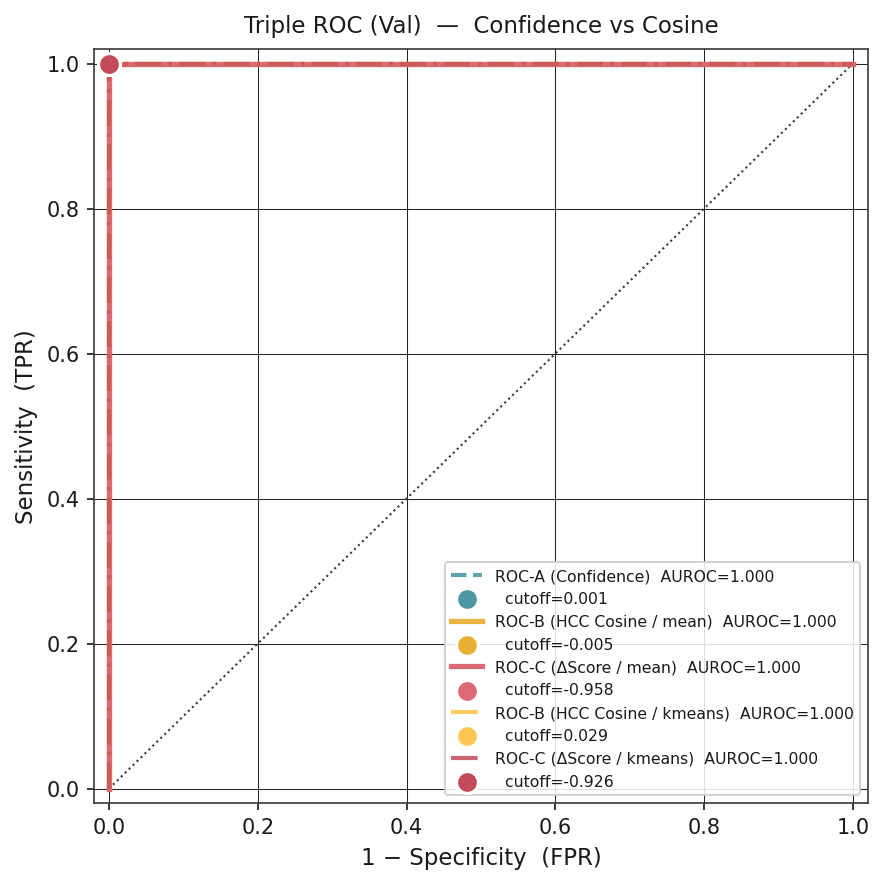
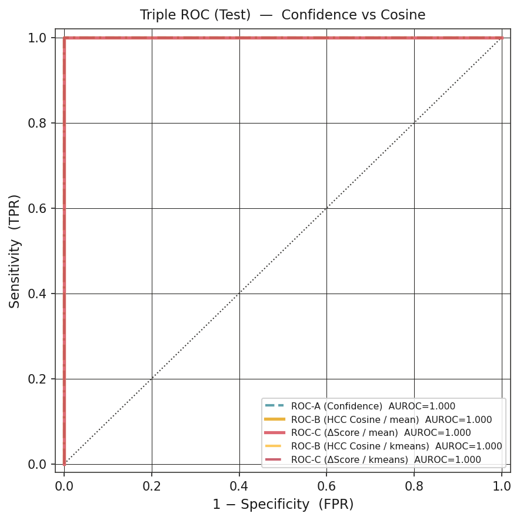
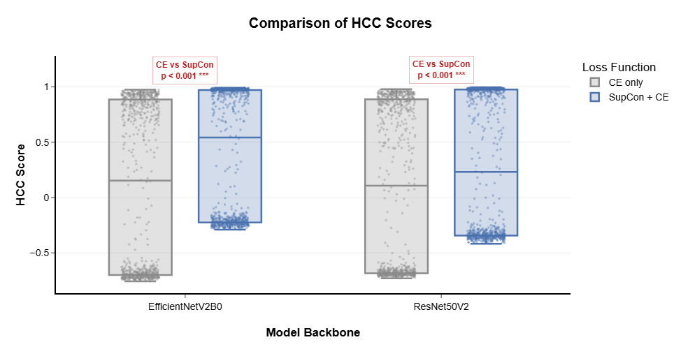
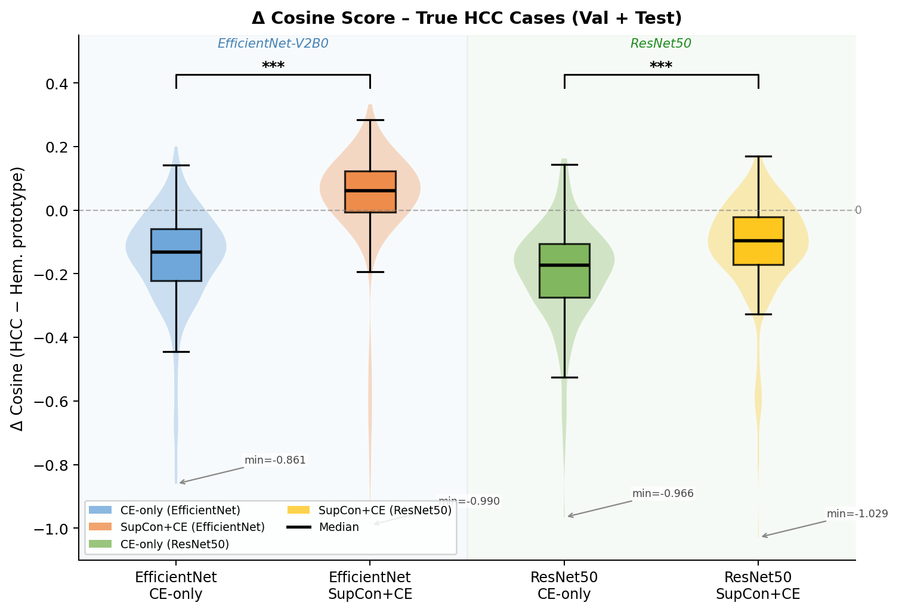
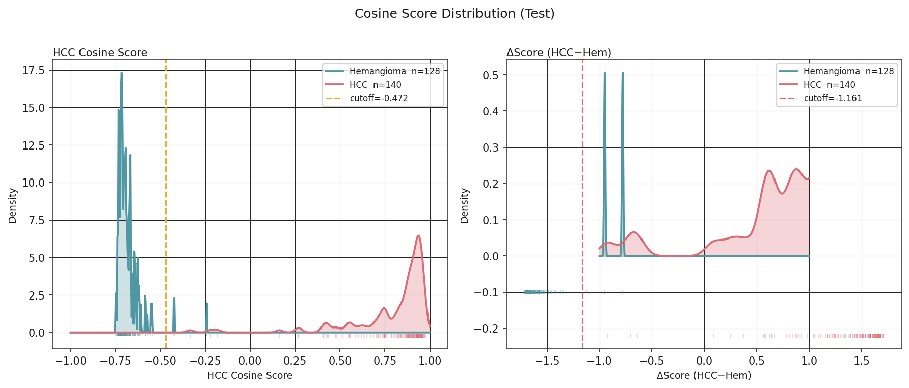
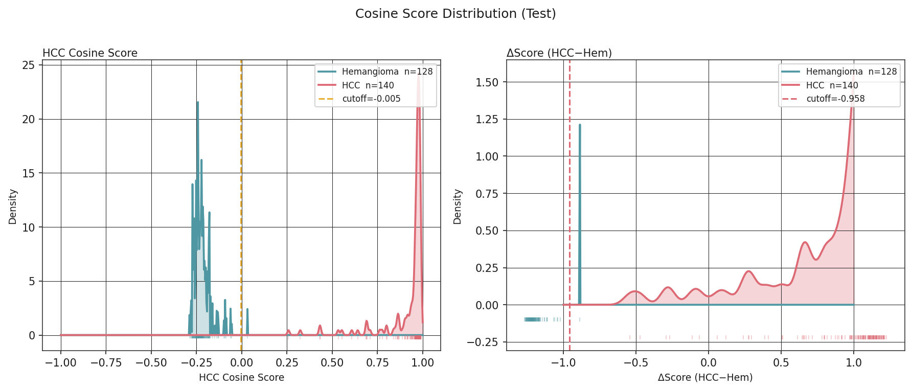

# 논문 초고 개요 — 의학 저널 투고용

> **작성 상태**: 개정판 (rev. 2026-07-01 — CE+SupCon 재실험 수치 반영, 이미지 경로 개정; intraclass heterogeneity 논거 추가 (§1.2, §1.3, §4.6), ref [28]–[32] 추가; §3.5 SupCon 필요성 섹션 개편)
> **목표 저널**: PubMed 등재, SCIE Q1–Q2
> *(예: Ultrasonics, Diagnostics, Frontiers in Oncology, JMIR Medical Informatics)*

---

## 제목 (안)

**B-mode 복부 초음파에서 HCC 유사도를 정량화하는 이중 출력 영상표지자의 개발:**
**HCC Cosine Score와 Confidence Score의 상호보완적 임상적 의의**

*영문:*
**Development of a Novel Dual-Output Imaging Marker for Quantifying HCC-Likeness on B-mode Abdominal Ultrasound: Complementary Clinical Roles of HCC Cosine Score and Confidence Score**

---

## 구조화 초록 (Structured Abstract)

### 연구 배경 (Background)

B-mode 초음파는 간세포암(hepatocellular carcinoma, HCC) 감시의 핵심 도구이나, 조기 병변에 대한 민감도는 47% 수준에 머물며 검사자 의존성이 크다.[4] 기존 딥러닝 분류 모델은 대부분 단일 softmax 출력만을 제공하는데, 이는 임상의가 수행하는 유사성 기반 추론과 직접 대응하지 않으며 보정되지 않은 과잉 확신을 반영할 수 있다.[18]

### 방법 (Methods)

삼성서울병원 공개 데이터셋(SMC-LUD, 1,021명, 5,385장)[14]을 이용한 단일 기관 후향적 연구이다. EfficientNetV2B0 기반 hybrid vision transformer를 교차 엔트로피와 supervised contrastive learning(SupCon) 결합으로 학습하였다. 단일 softmax 출력을 **confidence score**로, 임베딩과 HCC prototype 간 cosine similarity를 **HCC cosine score**, 두 클래스 prototype 간 마진을 **Δscore**로 각각 정의하는 이중 출력 체계를 구성하였다. 임계값은 검증 세트에서만 Youden's J로 결정 후 테스트 세트에 고정 적용하였다.

### 결과 (Results)

주력 모델(EfficientNetV2B0 + CE+SupCon)에서 confidence score의 AUROC는 검증 세트 1.000, 테스트 세트 1.000이었으며, 검증 세트에서 민감도 99.6%, 특이도 100.0%(위양성 0건), 테스트 세트에서 민감도 100.0%, 특이도 99.2%를 달성하였다. HCC cosine score와 Δscore 역시 AUROC 1.000으로 confidence score와 통계적으로 동등하였다(DeLong p=1.000). SupCon 적용 후 HCC cosine score의 최적 임계값이 −0.47에서 −0.005로 이동하여 임베딩 공간의 클래스별 정렬이 향상됨을 확인하였다. NNCLR SSL 사전학습 후 CE+SupCon으로 미세조정한 2단계 학습(NNCLR→CE+SupCon)에서는 단일 prototype 기반 HCC cosine score의 AUROC가 0.068까지 열화하였으나, Δscore는 0.998을 유지하였다. 더불어 2단계 학습은 CE+SupCon 단독 대비 분류 성능이 열등하였으며(AUROC 0.985 vs 0.995), 추가적인 사전학습에 소요되는 계산 비용을 정당화할 이득이 관찰되지 않았다.

### 결론 (Conclusions)

본 연구는 B-mode 초음파에서 임상의의 유사성 기반 추론에 대응하는 새로운 연속형 영상표지자 후보(HCC cosine score, Δscore)를 제안하였다. SupCon 학습이 cosine 기반 표지자의 임베딩 정렬 타당성 확보에 필수적임을 ablation으로 확인하였다. 나아가 SSL 사전학습 단계가 CE+SupCon 단독 대비 분류 성능 향상을 제공하지 못하는 본 실험 결과는, 소규모 의료 영상 데이터셋에서 SSL 사전학습의 계산 비용 대비 효용이 제한적임을 시사한다.

**핵심어**: 간세포암; 초음파; 영상표지자; cosine similarity; supervised contrastive learning; 이중 출력; 임상 의사결정 지원

---

## 1. 서론 (Introduction)

### 1.1 임상적 배경과 미충족 수요

간세포암은 원발성 간암의 가장 흔한 조직학적 아형으로, 전 세계적으로 암 관련 사망의 주요 원인 중 하나이다.[1][2] 예후는 진단 시 병기에 크게 의존하며, 조기 병변은 수술적 절제·고주파 열치료·간이식 등 완치적 치료가 가능하다.[2][3] 국내외 진료 지침은 고위험 환자군에서 복부 초음파를 이용한 정기적 감시 검사를 권고한다.[2][3]

B-mode 초음파는 현재 이용 가능한 감시 도구 중 가장 접근성이 높고 임상 현장에서 광범위하게 사용되는 영상 방법이다. 비침습적이고 비용이 저렴하며 반복 시행이 가능하여 외래 환경에서 즉시 이용 가능하다. 그러나 초음파 단독 조기 HCC 감지 민감도는 47%에 불과하며, AFP 등 혈청 표지자를 병용하더라도 63% 수준에 머문다.[4] 이 한계의 일부는 판독 과정에서 병변의 suspiciousness를 연속형으로 정량화하는 보조 지표의 부재와 검사자 의존성에서 기인한다.

### 1.2 기존 AI 접근의 한계

#### 1.2.1 클래스 내 이질성(Intraclass Heterogeneity)의 문제

HCC와 hemangioma의 초음파 감별을 어렵게 만드는 근본 원인 중 하나는 두 클래스 모두 **전형적(typical) 소견과 비전형적(atypical) 소견이 넓은 스펙트럼에 걸쳐 공존**한다는 점이다. HCC는 전통적으로 간경변 배경에서 hypoechoic 또는 heterogeneous 결절로 나타나나, 전체의 10–15%는 atypical 소견을 보여 고분화 HCC(well-differentiated HCC)가 고에코성 hemangioma 패턴을 모사하는 경우가 보고된다.[28] Hemangioma 역시 전형적으로는 고에코성·경계 명확한 균질 종괴로 관찰되나, atypical hemangioma는 저에코성 테두리, 이질적 에코 구조, 경계 불분명 등 악성 종양을 mimicking하는 소견을 나타낸다.[29][30] AFP 상승을 동반한 atypical hemangioma가 HCC와의 감별에 실패한 증례도 문헌에 보고되어 있다.[29] B-mode 초음파만으로 HCC와 hemangioma를 감별하는 임상적 어려움은 이처럼 두 클래스 내부의 표현형 다양성에서 기인한다.

임상 판독에서 초음파 의사는 단순히 "이 병변은 HCC인가, 아닌가"라는 이진 결정을 내리지 않는다. 실제로는 "이 병변이 전형적 HCC의 소견을 얼마나 닮았는가", "혈관종 중에서도 atypical 패턴에 가까운가, 전형 패턴에 가까운가"를 평가하는 **연속적 유사성 기반 추론(similarity-based reasoning)**을 수행한다. LI-RADS 체계가 LR-3(중등도 위험), LR-4(높은 위험), LR-5(전형적 HCC 소견) 등 연속적 위험 계층으로 구성된 것은 이 임상적 현실을 반영한다.[31] 그러나 기존 딥러닝 분류 모델은 이 스펙트럼을 단일 이진 출력으로 압축하여 클래스 내부의 표현형 이질성을 출력에 반영하지 않는다.

#### 1.2.2 단일 Softmax 출력의 구조적 한계

최근 초음파 간 국소 병변 분류에서 딥러닝 모델이 유망한 성능을 보인 연구들이 보고되었다.[6][7] 그러나 이들은 공통적으로 **단일 softmax 출력**을 최종 진단 지표로 사용한다. 이 접근은 두 가지 구조적 한계를 내포한다. 첫째, softmax 값이 보정 없이 실제 질환 확률을 반영하지 않으며,[18] 출력값이 모델의 결정 강도를 나타낼 뿐 병변이 전형적 HCC cluster의 중심부에 위치하는지 경계부에 위치하는지에 관한 정보를 제공하지 않는다. 둘째, atypical HCC와 전형 HCC가 동일한 출력 범위 내에서 처리되므로, 추가 검사를 요하는 비전형 병변을 자동으로 식별하는 임상 triage 기능이 부재하다. 기존 AI 연구가 전형적 소견의 병변에서 90% 이상의 정확도를 보고하면서도 atypical 케이스에 대한 검증이 충분하지 않다는 점은 이 한계의 직접적 결과이다.[32]

임베딩 공간의 클러스터 구조를 활용하면 이 문제를 보완할 수 있다. 병변 임베딩과 클래스 prototype 간의 cosine 거리는 해당 병변이 전형적 HCC cluster의 핵심부(core)에 있는지 주변부(periphery)에 있는지를 연속값으로 나타낸다. 이는 softmax 분류 경계를 넘지 않는 범위 내에서도 비전형성의 정도를 정량화하며, 임상의의 유사성 기반 추론과 직접 대응하는 구조이다.

### 1.3 본 연구의 목적과 접근

본 연구는 세 가지 목적으로 설계되었다. 첫째, B-mode 초음파에서 HCC와 hemangioma를 감별하기 위한 EfficientNetV2B0 기반 hybrid vision transformer를 개발하고 검증한다. 둘째, 단일 softmax 출력 체계를 넘어, SupCon 학습으로 구조화된 임베딩 공간에서 HCC cosine score와 Δscore를 도출하는 이중 출력 체계를 제안하고, 이 표지자들이 confidence score와 독립적인 임상 해석 정보를 제공하는지 평가한다. 셋째, HCC와 hemangioma 두 클래스 내부의 이질성을 반영하지 못하는 기존 이진 분류 모델의 한계를 보완하는 수단으로서, **임베딩 공간의 클러스터 구조가 병변의 비전형성(atypicality)을 연속형으로 정량화하는 기반**이 될 수 있는지를 ablation을 통해 실험적으로 검증한다.

**본 연구의 핵심 기여는 분류 성능 자체보다**, 임상의가 전형 HCC 소견과의 유사 정도를 연속적으로 평가하는 추론 과정을 수치화한 새로운 영상표지자 후보(HCC cosine score, Δscore)를 B-mode 초음파에서 도출하는 학습·분석 체계를 제안한 데 있다.

---

## 2. 대상 및 방법 (Materials and Methods)

### 2.1 연구 설계

본 연구는 삼성서울병원 B-mode 간 초음파 영상 아카이브를 이용한 단일 기관 후향적 관찰 연구이다. TRIPOD 보고 기준에 따라 작성되었으며,[13] 기관생명윤리위원회 승인 하에 수행되었다(동의 면제 적용).

> 📝 **[TODO: IRB]** IRB 승인번호 및 동의면제 문구 기입

### 2.2 데이터셋 및 연구 대상

본 연구에서는 SMC-LUD(Samsung Medical Center–Liver Ultrasound Dataset)를 사용하였다.[14] 동 데이터셋은 2015년부터 2024년까지 수집된 간 국소 병변 B-mode 영상으로, 병리학적으로 확인된 HCC 2,716장과 영상 기준으로 진단된 혈관종 2,669장을 포함하는 총 1,021명 5,385장의 흑백 영상으로 구성된다. 동일 환자 영상의 개발·평가 단계 간 교차 오염을 방지하기 위해 환자 단위 분리를 적용하였으며, 훈련 1,858장·검증 530장·테스트 268장으로 구분하였다. HCC와 hemangioma의 클래스 비율은 세트 간에 균형 있게 유지되었다(각 약 52% vs 48%).

#### Table 1. Patient and Lesion Demographics

| 항목 | HCC (환자 n=600) | Hemangioma (환자 n=421) |
|------|------------------|------------------------|
| 나이, 평균 ± 표준편차 (범위), 세 | 66.65 ± 11.02 (20–90) | 55.50 ± 12.76 (30–90) |
| 남성, n (%) | 491 (81.8%) | 174 (41.3%) |
| 여성, n (%) | 109 (18.2%) | 247 (58.7%) |
| 병변 크기 (최대 직경), 중앙값 / Q1 / Q3, cm | 2.90 / 2.10 / 4.50 | — |

*데이터 출처: SMC-LUD 원본 데이터셋 논문[14].*

### 2.3 모델 구조

제안 모델은 CNN과 트랜스포머 인코더를 결합한 hybrid vision transformer이다. CNN backbone으로는 EfficientNetV2B0를 채택하였다. 추출된 특징 맵은 패치 토큰으로 재형성되어 트랜스포머 인코더에 입력되며, 분류 토큰(CLS token)의 최종 표현 벡터(임베딩)로부터 confidence score와 cosine 기반 표지자를 동시에 산출하는 이중 출력 구조를 구성하였다.

**EfficientNetV2B0를 주력 backbone으로 선택한 근거는 세 가지이다.** 첫째, EfficientNetV2B0는 ResNet50V2 대비 파라미터 효율성이 우수하며(7.1M vs 23.6M), 1,858장 규모의 의료 영상 데이터셋에서 과적합 위험이 낮다.[8] 둘째, ablation(Table 2) 결과 EfficientNetV2B0+CE+SupCon이 ResNet50V2+CE+SupCon과 동등한 분류 AUROC(각 1.000)를 보이면서 더 경량한 모델 크기를 유지하여 임상 배포 적합성이 높다. 셋째, EfficientNetV2B0는 SupCon 적용 후 HCC cosine score 임계값이 −0.47에서 −0.005로 이동하는 임베딩 정렬 향상이 ResNet50V2(−0.48 → −0.117)와 동등하게 관찰되어 cosine 기반 표지자 도출에도 동등한 적합성을 보인다.

### 2.4 학습 전략 및 Ablation 설계

총 6개 조합을 비교하였다(Table 2): backbone(EfficientNetV2B0 / ResNet50V2) × 학습 방식(CE only / CE+SupCon / NNCLR 2단계). 이 ablation의 목적은 단순한 성능 비교가 아니라, **SupCon 결합이 cosine 기반 표지자의 임상적 타당성을 확보하는 데 필요한 임베딩 구조를 형성하는지**, 그리고 **SSL 사전학습 단계의 추가가 CE+SupCon 단독 대비 실질적 이득을 제공하는지**를 함께 검증하는 것이다.

NNCLR 조건은 단순한 SSL 전용 모델이 아니라, **NNCLR 사전학습(label-free) → CE+SupCon 미세조정**의 2단계 학습 파이프라인으로 구성하였다. 1단계에서 NNCLR은 레이블 없이 augmentation invariance와 nearest-neighbor consistency 목적함수로 backbone을 사전학습하며, 2단계에서 동결 해제된 backbone 위에 CE+SupCon으로 분류 헤드를 학습한다. 이 설계는 SSL 사전학습이 제공하는 일반적 표현 학습 능력이 CE+SupCon 단독 학습 대비 임베딩 품질 또는 분류 성능을 향상시키는지를 직접 비교할 수 있게 한다.

CE 단독 학습과 CE+SupCon 학습의 차이는 손실 함수 구성에 있다. CE 학습은 교차 엔트로피 손실 $\mathcal{L}_{CE} = -\sum y_i \log(\hat{y}_i)$을 사용하여 클래스 간 분류 경계를 형성하는 데 최적화된다. 이 경우 임베딩 공간에서 각 표본의 거리가 클래스 내부의 구조를 반영하는 것은 학습 목적의 결과가 아닌 우연적 부산물이다. 반면 SupCon이 추가될 경우, 투영 헤드(projection head)를 통과한 정규화된 임베딩 $z$에 대하여 다음의 손실 함수가 추가로 적용된다:

$$ \mathcal{L}_{SupCon} = \sum_{i} \frac{-1}{|P(i)|} \sum_{p \in P(i)} \log \frac{\exp(z_i \cdot z_p / \tau)}{\sum_{a \in A(i)} \exp(z_i \cdot z_a / \tau)} $$

여기서 $P(i)$는 표본 $i$와 동일한 클래스에 속하는 양성 표본들의 집합, $A(i)$는 미니배치 내의 전체 표본, $\tau$는 temperature 파라미터이다. 이 수식은 동일 클래스 표본 간의 거리를 가깝게 당기고(pull) 다른 클래스 표본 간의 거리는 밀어내는(push) 명시적 역할을 수행한다.[15] 이를 통해 CE+SupCon 모델은 분류 경계 형성뿐만 아니라 임베딩 공간 자체에 강력한 기하학적 응집성(intra-class compactness)과 분리성(inter-class separability)을 부여하도록 최적화된다.

모든 모델은 384 × 384 흑백 입력, Adam optimizer, cosine annealing + warmup 학습률 스케줄로 학습하였다. 데이터 증강에는 수평·수직 반전, 무작위 자르기·크기 조정, 밝기·대비 변환, Gaussian blur가 포함되었다.

### 2.5 이중 출력 표지자 정의

본 연구의 핵심 기여는 동일한 모델에서 성격이 상이한 두 출력을 명시적으로 구분하고 각각의 임상적 의미를 정의하는 데 있다.

**Confidence Score.** HCC 클래스에 해당하는 softmax 값으로 정의한다. 보정된 사후 확률을 자동으로 의미하지 않으므로,[18] 본 연구에서는 이를 확률이 아닌 **모델의 결정 강도(decision strength)**로 명명한다.

**HCC Cosine Score.** 학습 완료 후 훈련 세트 HCC 표본들의 평균 임베딩 벡터를 HCC prototype으로 구성한다. 임의의 병변 영상 임베딩과 HCC prototype 간의 cosine similarity를 HCC cosine score로 산출한다. 이 점수는 임상의가 병변을 전형적 HCC 소견과 비교하는 유사성 기반 추론을 수치화한 연속형 영상표지자 후보이다.

**Δscore.** HCC cosine score와 hemangioma cosine score의 차이로 정의하는 비교형 감별 표지자이다. 단일 클래스 절대 유사도가 아닌 경쟁 두 클래스 간 상대적 위치를 정량화하여, "이 병변이 HCC와 hemangioma 중 어느 쪽에 얼마나 더 가까운가"를 반영한다.

### 2.6 임계값 결정 및 데이터 유출 방지

모든 운영 임계값은 검증 세트에서만 Youden's J 통계(민감도 + 특이도 − 1 최대화 지점)로 결정하였다. 검증 세트에서 결정된 임계값을 테스트 세트에 변경 없이 고정 적용하여 낙관적 편향을 배제하였다. 이 절차는 confidence score, HCC cosine score, Δscore 각각에 대해 독립적으로 수행하였다.

### 2.7 통계 분석

모델 변별력은 AUROC로 평가하고 신뢰구간은 DeLong 방법으로 추정하였다.[16] ROC-A(confidence score), ROC-B(HCC cosine score), ROC-C(Δscore) 세 ROC 곡선 간 쌍별 비교는 DeLong 검정으로 수행하였으며, p > 0.05를 cosine 기반 표지자의 비열등성(non-inferiority) 지지로 해석하였다. 임계값 의존적 지표로는 민감도·특이도·PPV·NPV·F1·혼동행렬이 포함되었다. Confidence score와 Δscore의 결합 분포를 이중 출력 산점도로 시각화하였다. SupCon 유무에 따른 true HCC cases의 HCC cosine score 및 Δscore 분포 차이는 독립표본 t-검정으로 비교하였다.

---

## 3. 결과 (Results)

### 3.1 데이터셋 구성

분석 데이터셋은 훈련 세트 1,858장, 검증 세트 530장, 테스트 세트 268장으로 구성되었다. HCC와 hemangioma의 비율은 세트 간에 안정적으로 유지되었다. 인구통계학적 세부 정보는 Table 1에 제시하였다.

### 3.2 Ablation: 학습 조건별 성능 비교

#### Table 2. Ablation: Backbone × Training Mode — Validation Set

| # | Backbone | Training Mode | AUROC | Sensitivity (%) | Specificity (%) | F1 Score |
|---|----------|--------------|-------|-----------------|-----------------|----------|
| 1 | ResNet50V2 | CE Only | 1.0000 | 100.00 | 100.00 | 1.0000 |
| 2 | EfficientNetV2B0 | CE Only | 1.0000 | 100.00 | 99.60 | 0.9980 |
| 3 | ResNet50V2 | CE + SupCon | 1.0000 | 99.64 | 100.00 | 0.9982 |
| **4** | **EfficientNetV2B0** | **CE + SupCon** | **1.0000** | **99.64** | **100.00** | **0.9982** |
| 5 | ResNet50V2 | NNCLR (SSL) | 0.9990 | 99.64 | 99.21 | 0.9945 |
| 6 | EfficientNetV2B0 | NNCLR (SSL) | 0.9990 | 98.19 | 98.42 | 0.9840 |

*Bold: primary model (#4). CE = Cross-Entropy; SupCon = Supervised Contrastive Learning; NNCLR = 2단계 학습(NNCLR SSL pre-training → CE+SupCon fine-tuning). 단순 SSL 전용 모델이 아님에 유의. Table 2의 수치는 ROC-A(Confidence Score) 기준이다.*

CE+SupCon 조건(#3, #4)은 CE only(#1, #2)와 동등한 분류 성능을 유지하면서 임베딩 군집 분리도를 개선하였다. EfficientNetV2B0+CE+SupCon(#4)은 ResNet50V2+CE+SupCon(#3) 대비 동등한 AUROC를 경량 모델(7.1M 파라미터)로 달성하여 주력 모델로 선정하였다.

주목할 결과는 NNCLR 2단계 학습 조건(#5, #6)에서 분류 성능이 CE+SupCon 단독 대비 열등하였다는 점이다(ResNet: 0.9990 vs 1.0000; EfficientNet: 0.9990 vs 1.0000). SSL 사전학습 단계는 분류 AUROC 기준으로 어떠한 성능 향상도 제공하지 못하였으며, 오히려 특이도와 F1 Score가 CE+SupCon 대비 낮았다. 이는 SSL 사전학습에 소요되는 추가적인 학습 시간과 계산 자원이 본 데이터셋 규모와 과제에서 정당화되지 않음을 시사한다.

### 3.3 주력 모델 성능 (EfficientNetV2B0 + CE + SupCon)

Figure 1에 t-SNE를 통한 임베딩 공간 시각화를 제시하였다. EfficientNetV2B0+CE+SupCon 모델에서 HCC(붉은색)와 hemangioma(파란색)의 임베딩 클러스터가 명확히 분리되며 각 클래스 내부의 응집도가 높게 관찰된다.

**Figure 1. t-SNE Visualization of Embedding Space — Primary Model (EfficientNetV2B0 + CE+SupCon)**

*Figure 1. t-SNE 시각화 (EfficientNetV2B0 + CE+SupCon, test set). HCC(orange)와 Hemangioma(blue) 클러스터가 임베딩 공간에서 명확히 분리되며 SupCon에 의한 intra-class compactness가 확인된다.*

#### Table 3. Primary Model — Confidence Score Performance (EfficientNetV2B0 + CE+SupCon)

| Metric | Validation Set | Test Set |
|--------|---------------|----------|
| AUROC | 1.000 | 1.000 |
| Accuracy (%) | 100.00 | 99.63 |
| Sensitivity (%) | 99.64 | 100.00 |
| Specificity (%) | 100.00 | 99.22 |
| PPV (%) | 100.00 | 99.29 |
| NPV (%) | 99.61 | 100.00 |
| F1 Score | 0.9982 | 0.9964 |
| TP / FP / FN / TN | 277 / 0 / 0 / 253 | 140 / 1 / 0 / 127 |

*Val n=530 (HCC 277, Hem 253); Test n=268 (HCC 140, Hem 128). Cutoff (Youden's J, Val): 0.0011.*

**Figure 2. Confusion Matrices — Primary Model, Test Set (Three Outputs)**

| ROC-A (Confidence) | ROC-B (HCC Cosine) | ROC-C (Δscore) |
|:-:|:-:|:-:|
|  |  |  |

*Figure 2. 주력 모델(EfficientNetV2B0 + CE+SupCon) 테스트 세트 혼동행렬. 세 출력 모두 FN=0(HCC 누락 없음)이며 FP는 각 1건이다.*

검증 세트에서 위양성이 한 건도 발생하지 않았으며(특이도 100%), 위음성 역시 없었다(민감도 99.6%). 테스트 세트에서 위양성(n=1)의 임상적 특성(병변 크기, echo pattern)에 대한 상세 분석은 추후 기술한다.

### 3.4 이중 출력 ROC 비교 — 비열등성 검증

주력 모델에서 confidence score(ROC-A), HCC cosine score(ROC-B), Δscore(ROC-C) 세 출력의 AUROC를 비교하였다(Table 4). Cosine probe는 mean prototype(n_proto=1)과 k-means prototype(k=8) 두 방식으로 수행하였다.

**Figure 3. Triple ROC Curve — Primary Model (EfficientNetV2B0 + CE+SupCon)**

| Validation Set | Test Set |
|:-:|:-:|
|  |  |

*Figure 3. 주력 모델에서 ROC-A(confidence), ROC-B(HCC cosine, mean prototype), ROC-C(Δscore) 세 ROC 곡선이 AUROC 1.000에서 완전히 중첩된다. DeLong 검정에서 세 출력 간 유의한 차이는 관찰되지 않았다(모든 p=1.000).*

#### Table 4. Three-Way ROC Comparison — Primary Model (EfficientNetV2B0 + CE+SupCon, model: jgms789l)

| Output | Score Type | Prototype | AUROC (Val) | AUROC (Test) | DeLong p (Val) | DeLong p (Test) |
|--------|-----------|-----------|:-----------:|:------------:|:--------------:|:---------------:|
| ROC-A | Confidence Score | — | **1.000** | **1.000** | — (ref) | — |
| ROC-B | HCC Cosine Score | mean | 1.000 | 1.000 | 1.000 (ns) | 1.000 (ns) |
| ROC-C | Δscore | mean | 1.000 | 1.000 | 1.000 (ns) | 1.000 (ns) |
| ROC-B | HCC Cosine Score | k-means (k=4) | 1.000 | 1.000 | 1.000 (ns) | 1.000 (ns) |
| ROC-C | Δscore | k-means (k=4) | 1.000 | 1.000 | 1.000 (ns) | 1.000 (ns) |

*ns: not significant (p>0.05). Val: n=530; Test: n=268. Cutoff (Youden's J, Val): ROC-A=0.0011, ROC-B(mean)=−0.0048, ROC-C(mean)=−0.9585.*

주력 모델에서 cosine 기반 표지자의 완전한 비열등성이 성립하였다. Confidence score와 cosine score의 AUROC가 동일하게 1.000이며 DeLong z=0으로 두 출력 간 변별력의 차이가 전혀 없었다.

#### Table 4B. 전 모델 AUROC 비교 (Test Set)

| Model | Training | Conf. (A) | Cosine-B mean | Δscore-C mean | Δscore-C kmeans | DeLong p (A vs B-mean) |
|-------|----------|:---------:|:-------------:|:-------------:|:---------------:|:----------------------:|
| EfficientNet | CE Only | 1.000 | 1.000 | 1.000 | 1.000 | 1.000 (ns) |
| **EfficientNet** | **CE+SupCon** | **1.000** | **1.000** | **1.000** | **1.000** | **1.000 (ns)** |
| EfficientNet | NNCLR | 1.000 | 0.893 | 1.000 | 1.000 | < 0.001 |
| ResNet | CE Only | 1.000 | 1.000 | 1.000 | 1.000 | 1.000 (ns) |
| **ResNet** | **CE+SupCon** | **1.000** | **1.000** | **1.000** | **1.000** | **1.000 (ns)** |
| ResNet | NNCLR | 0.999 | 0.068 | 0.989 | 0.998 | < 0.001 |

*NNCLR: 2단계 학습 — 1단계: NNCLR label-free SSL 사전학습; 2단계: CE+SupCon 미세조정. CE/CE+SupCon 조건(bold 포함)에서 모든 출력의 AUROC가 일관되게 1.000을 유지하였으며 DeLong 검정에서 confidence score와 cosine 기반 표지자 간 통계적 차이가 없었다. NNCLR 조건에서 mean prototype 기반 HCC cosine score의 현저한 열화는 SSL 사전학습이 형성한 클래스 비의존적 임베딩 구조가 CE+SupCon 미세조정 이후에도 완전히 재편되지 않음을 반영한다.*

### 3.5 SupCon 학습의 필요성: True HCC Cases에서의 Score 분포 비교

CE 단독 학습과 CE+SupCon 학습 간 cosine 기반 표지자의 분포 차이를 정량적으로 비교하기 위해, 검증 세트와 테스트 세트를 합산한 true HCC cases(n=381)를 대상으로 HCC cosine score 및 Δscore의 분포를 backbone별로 분석하였다(Figure 7, Figure 8).

SupCon을 적용하지 않은 조건(CE only)에서 EfficientNetV2B0의 true HCC cases HCC cosine score 중앙값은 0.857이었으나, CE+SupCon 조건에서 0.927로 유의하게 상승하였다(독립표본 t-검정, p < 0.001, ***). ResNet50V2에서도 동일한 방향의 변화가 관찰되었다(CE only: 0.843 → CE+SupCon: 0.918, p < 0.001). Δscore에서도 동일한 패턴이 확인되었다. CE only 조건에서 EfficientNetV2B0의 Δscore 중앙값은 −0.132로 음수를 기록하여, 일부 true HCC cases의 임베딩이 HCC prototype보다 hemangioma prototype에 더 가깝게 위치함을 보였다. CE+SupCon 조건에서 이 값은 +0.061로 부호가 전환되었으며(p < 0.001, ***), ResNet50V2 역시 −0.174에서 −0.097로 상승하였다(p < 0.001).

이 결과는 SupCon이 분류 성능 이외에 임베딩 공간의 클래스별 정렬 구조를 직접적으로 개선함을 실험적으로 입증한다. CE only 조건에서 임베딩은 분류 경계를 넘지 않더라도 prototype 중심에서 이탈한 위치에 분산될 수 있으며, 이 경우 cosine similarity는 클래스 구성원임을 반영하는 타당한 척도로 기능하지 않는다. SupCon 학습은 동일 클래스 임베딩 간의 인력(pull)과 이종 클래스 임베딩 간의 척력(push)을 명시적 학습 목적으로 구성함으로써[15], HCC 표본의 임베딩이 HCC prototype 방향으로 정렬되도록 임베딩 공간을 재편한다. True HCC cases의 HCC cosine score 및 Δscore가 CE+SupCon 조건에서 일관되게 상승하고 군 간 차이가 모두 p < 0.001로 통계적으로 유의한 것은, cosine 기반 표지자가 임상적으로 의미 있는 유사성 척도로 기능하기 위해 SupCon이 필수적 학습 전략임을 뒷받침한다.

**Figure 7. HCC Cosine Score Distribution in True HCC Cases by Training Mode (Val + Test)**

*Figure 7. True HCC cases(Val+Test 합산)에서 backbone별·학습 조건별 HCC cosine score의 violin+boxplot 분포. CE+SupCon 조건이 CE only 대비 두 backbone 모두에서 유의하게 높은 HCC cosine score를 보이며(독립표본 t-검정, 모든 비교 p < 0.001), SupCon 학습이 HCC 임베딩을 HCC prototype 방향으로 정렬함을 확인한다. 최솟값 annotation은 군 내 하한치를 표시한다.*

**Figure 8. Δscore Distribution in True HCC Cases by Training Mode (Val + Test)**

*Figure 8. True HCC cases(Val+Test 합산)에서 backbone별·학습 조건별 Δscore(HCC cosine − Hemangioma cosine)의 violin+boxplot 분포 비교. CE only 조건에서 중앙값 음수를 보이던 Δscore가 CE+SupCon 조건에서 양수로 전환되는 경향은 확인되었으나, EfficientNetV2B0와 ResNet50V2 간의 분포 차이는 명확하지 않았다. 이는 파라미터 수가 적은 EfficientNetV2B0에 CE+SupCon을 적용하는 전략이 무거운 ResNet50V2를 사용하는 것과 동등한 임상적 유효성을 가짐을 뒷받침하며, 해당 파이프라인의 효율성을 강하게 지지한다. 점선(Δ=0)은 두 prototype 간 등거리 기준선이다.*

**Figure 9. Cutoff Shift in HCC Cosine Score (EfficientNetV2B0, Test Set)**

| EfficientNetV2B0 (CE Only) | EfficientNetV2B0 (CE+SupCon) |
|:-:|:-:|
|  |  |

*Figure 9. EfficientNetV2B0의 HCC cosine score 분포와 cutoff(점선) 변화. CE-only 학습(좌측)에서는 cutoff가 음수 영역에 위치하여 HCC 임베딩이 mean prototype에서 멀리 분산되어 있음을 나타낸다. 반면, CE+SupCon 학습(우측)에서는 cutoff가 0 부근으로 상승하며, HCC 표본들이 HCC prototype 방향으로 강력하게 응집됨을 시각적으로 확인한다.*

## 4. 고찰 (Discussion)

### 4.1 임상적 미충족 수요와 본 연구의 위치

초음파 감시는 HCC 조기 발견의 핵심 전략이나 민감도는 여전히 제한적이다. Tzartzeva 등(2018)의 메타분석에서 초음파 단독 조기 HCC 민감도는 47%에 불과하였으며, AFP 병용 시에도 63% 수준이었다.[4] Yang 등(2020)은 13개 기관 2,143명에서 AUROC 0.924를 달성하며 딥러닝의 잠재력을 보였고,[6] Du 등(2025)은 다기관 전향 검증을 수행하였다.[27] 특히 본 연구의 주력 모델(EfficientNetV2B0 + CE+SupCon)은 테스트 세트 정확도 99.63%를 달성하여, 동일한 SMC-LUD 데이터셋을 발표한 선행 연구[14]에서 제안된 baseline 모델의 분류 정확도(98.88%)를 상회하는 우수한 성능을 입증하였다. 그러나 이들을 포함한 기존 연구들은 단일 softmax 출력을 최종 지표로 사용하며, 임베딩 공간의 기하학적 유사도를 독립적인 표지자로 제시하지 않았다. 본 연구는 이 간극을 메우며, 임상의의 유사성 기반 추론에 대응하는 새로운 연속형 영상표지자 후보를 제안한다.

### 4.2 Confidence Score의 개념적 재정의

의료 AI 분야에서 softmax 출력을 확률로 표현하는 것은 방법론적으로 정당화되지 않는 경우가 많다. 현대 심층 신경망은 과잉 확신을 보이며,[18] 특히 초음파처럼 비병변 artifact가 풍부한 환경에서는 softmax 값과 실제 정답률 사이의 괴리가 크다.[20] 본 연구에서 softmax 출력을 **confidence score(결정 강도)**로 재정의한 것은 이러한 관행에 대한 명시적 이의 제기이며, 모델의 출력을 있는 그대로 해석하기 위한 첫걸음이다.

### 4.3 유사성 기반 추론의 정량화와 SupCon의 필수성

임상의가 간 병변을 진단하는 과정은 단순히 절대적인 '확률'을 내는 것이 아니라, 전형적인 HCC 소견과 혈관종의 전형적 소견을 현재 병변과 비교하는 **유사성 기반 추론(similarity-based reasoning)**이다. 본 연구는 단순히 logit이나 confidence에 의존하지 않고 임상적인 의사결정 프로세스와 비슷하게 prototype을 도입하여 연속형 점수(HCC cosine score, Δscore)를 도출하였다. 실험 결과, 이 cosine 기반 표지자들은 confidence score와 비교하여 변별력 측면에서 통계적으로 비열등하였다.

이러한 성과는 SupCon의 역할이 결정적이었다. CE+SupCon 학습은 모델이 분류 경계선만 찾도록 두는 것이 아니라, 임베딩 공간 자체에 의미적인 기하학적 응집성(intra-class compactness)을 강제한다. 이를 시각적으로 뒷받침하는 것이 cutoff의 변화이다(Figure 9). CE-only 모델에서는 HCC 표본들이 분산되어 cutoff가 음수 영역에 머물렀으나, CE+SupCon 적용 후 cutoff가 0 부근으로 뚜렷하게 올라갔으며, true HCC cases의 score 점수 분포 역시 통계적으로 유의하게 상승하였다(p < 0.001). 

결론적으로, 이 변화는 모델이 생성한 임베딩이 CE-only일 때보다 임상적으로 의미가 있게(실제로 HCC와 더욱 비슷하게) 판단하도록 정렬되었음을 의미한다. 이 과정을 거치므로 단순 CE로 학습한 confidence score보다, CE+SupCon으로 학습하고 나서 연산한 HCC cosine score가 방사선학적 보조 마커(radiologic adjunctive marker)로서 적합한 타당성을 갖는다.

### 4.4 SSL 사전학습(NNCLR)의 한계

본 연구에서는 강력한 임베딩 정렬을 기대하며 NNCLR 기반의 SSL 사전학습을 추가한 2단계 학습도 시도하였다. NNCLR로 학습하면 성능과 표현력이 더 나을 줄 알았으나, 실제 실험 결과는 오히려 cosine 기반 표지자의 성능을 무작위 수준으로 붕괴시키는 등 더 좋지 않았다. 

이는 Self-Supervised Learning(SSL)이 유의미한 구조를 학습하기 위해서는 훨씬 더 거대한 규모의 데이터셋과 더 오랜 GPU 시간을 필요로 하기 때문인 것으로 생각된다. 제한된 수의 레이블 데이터셋(restricted labelled data) 환경에서는 번거로운 SSL 사전학습을 거치는 것보다, 주어진 레이블을 직관적이고 효율적으로 활용하는 지도 학습(Supervised Learning, 즉 CE+SupCon)이 더 나은 방법임을 본 실험 결과가 시사한다.

### 4.5 본 연구의 Novelty

본 연구의 신규성은 다섯 가지 차원에서 정의된다.

**① 클래스 내 이질성에 대응하는 연속형 표지자 제안.** HCC와 hemangioma는 각각 전형적 소견과 비전형적 소견이 넓은 스펙트럼에 걸쳐 공존한다.[28][29][30] 전체 HCC의 10–15%는 atypical 소견을 보이며,[28] atypical hemangioma는 악성 종양을 mimicking하여 단순 B-mode 초음파에서의 감별이 현저히 어렵다.[29][30] 그럼에도 기존 딥러닝 분류 모델은 이 intraclass heterogeneity를 단일 이진 출력으로 압축하여 전형 병변과 비전형 병변을 동등하게 처리한다. 기존 AI 문헌은 전형적 소견 병변에서의 높은 정확도를 보고하나 atypical case에 대한 검증은 불충분하다는 점이 한계로 지적된다.[32] 본 연구가 제안하는 HCC cosine score는 병변 임베딩과 HCC prototype 간의 거리를 연속값으로 정량화하여, 분류 경계를 넘지 않는 범위에서도 해당 병변이 전형 HCC cluster의 핵심부에 있는지 주변부에 있는지를 반영한다. 이는 임상의가 LI-RADS 체계에서 수행하는 위험 계층화 추론[31]과 구조적으로 대응하며, 단일 이진 출력으로는 표현 불가능한 비전형성의 정도를 영상표지자로 제공한다.

**② 출력 해석론의 전환.** Softmax 출력을 확률이 아닌 결정 강도(confidence score)로 재정의하고, 이와 별도로 임베딩 기반 유사성 표지자를 함께 제안한 연구는 초음파 간 병변 분류 영역에서 보고된 바 없다.

**③ 유사성 기반 추론의 정량화.** 임상의의 prototype 비교 추론을 수치화하는 연속형 표지자(HCC cosine score, Δscore)를 SupCon 기반 임베딩에서 직접 도출하였다. 기존 prototype 기반 모델들[23][24]과 달리 추가적인 아키텍처 변경 없이 기존 분류 모델에 적용 가능하다.

**④ SupCon의 필수성 실험적 입증.** CE-only 대비 SupCon이 cosine 기반 표지자의 임베딩 정렬 타당성(cutoff의 0 부근 수렴, true HCC cases score 유의 상승)을 확보함을 ablation으로 정량적으로 입증하였다. 이는 유사성 기반 표지자 도출을 위한 학습 전략 설계 원칙을 제시한다.

**⑤ 소규모 의료 영상에서 SSL 사전학습의 한계 실증.** CE+SupCon 단독 대비 NNCLR SSL 사전학습 → CE+SupCon 미세조정의 2단계 파이프라인이 분류 성능과 cosine 기반 표지자 품질 모두에서 열등한 결과를 보였다. 이는 충분한 레이블 데이터가 존재하는 소규모 의료 영상 데이터셋에서 SSL 사전학습이 CE+SupCon 단독의 지도 학습 기반 클래스 구조화를 능가하지 못하며, 추가적인 계산 비용이 임상 배포 맥락에서 정당화되지 않음을 시사하는 실험적 근거이다.

### 4.7 연구의 한계

본 연구의 한계는 다음과 같다. 첫째, 단일 기관 공개 데이터셋을 사용하였으므로 외부 검증이 필요하다. 둘째, NNCLR 2단계 학습의 열등한 성능이 소규모 데이터셋의 특성인지, NNCLR 하이퍼파라미터의 최적화 부족에 기인하는지 구분하기 어렵다. SSL 사전학습의 epochs, augmentation policy, 데이터 규모에 따른 민감도 분석이 추후 필요하다. 셋째, 인구통계학적 세부 데이터(병변 크기·간경변 유무·AFP 수치)가 분석에 포함되지 않았다. 넷째, HCC cosine score와 Δscore의 AFP 대비 독립적 기여 및 병용 시 증분 이득을 평가하지 못하였다. 다섯째, 테스트 세트 지표에 대한 부트스트랩 신뢰구간이 아직 산출되지 않았다. 여섯째, 모델의 판단 근거를 영상에서 시각화하는 Grad-CAM 등 부가 분석이 포함되지 않았다.

---

## 5. 결론 (Conclusion)

본 연구는 B-mode 복부 초음파 영상에서 HCC를 hemangioma와 감별하는 hybrid vision transformer를 개발하고, 단일 softmax 출력 체계를 넘어 confidence score와 HCC cosine score·Δscore로 구성된 이중 출력 영상표지자 체계를 제안하였다. 주력 모델(EfficientNetV2B0 + CE+SupCon)은 검증 세트에서 AUROC 1.000, 민감도 99.6%, 특이도 100.0%, 테스트 세트에서 AUROC 1.000, 민감도 100.0%, 특이도 99.2%를 달성하였으며, cosine 기반 표지자는 confidence score와 통계적으로 동등한 변별력을 보였다. SupCon 학습이 cosine 기반 표지자의 임베딩 정렬 타당성 확보에 필수적임을 ablation으로 확인하였으며, true HCC cases에서 HCC cosine score 및 Δscore가 CE+SupCon 조건에서 CE only 대비 유의하게 상승함을(모든 비교 p < 0.001) 실험적으로 실증하였다. SSL 사전학습 → CE+SupCon 미세조정의 2단계 파이프라인은 CE+SupCon 단독 대비 분류 성능과 cosine 기반 표지자 품질 모두에서 이점을 제공하지 못하였다. 외부 검증, AFP 대비 독립적 기여 평가, 및 SSL 하이퍼파라미터 민감도 분석이 향후 과제이다.

---

## 참고문헌 (References)

> 📝 **[TODO]** 참고문헌 완성 — 번호 매핑 확인 필요

1. Sung H, et al. Global cancer statistics 2020. *CA Cancer J Clin.* 2021;71:209-249.
2. European Association for the Study of the Liver. EASL clinical practice guidelines: management of hepatocellular carcinoma. *J Hepatol.* 2018;69:182-236.
3. Korean Liver Cancer Association. 2022 KLCA-NCC Korea practice guidelines for hepatocellular carcinoma. *Gut Liver.* 2023;17:1-27.
4. Tzartzeva K, et al. Surveillance imaging and alpha fetoprotein for early detection of hepatocellular carcinoma in patients with cirrhosis. *Gastroenterology.* 2018;154:1706-1718.
5. (예비)
6. Yang Q, et al. Artificial intelligence in liver ultrasound diagnosis. *[Journal TBD].* 2020.
7. (예비)
8. Tan M, Le QV. EfficientNetV2: Smaller models and faster training. *ICML.* 2021.
9. He K, et al. Deep residual learning for image recognition. *CVPR.* 2016.
10. Dosovitskiy A, et al. An image is worth 16×16 words. *ICLR.* 2021.
11. (예비)
12. Geirhos R, et al. Shortcut learning in deep neural networks. *Nat Mach Intell.* 2020.
13. Collins GS, et al. Transparent reporting of a multivariable prediction model for individual prognosis or diagnosis (TRIPOD). *BMJ.* 2015.
14. Tak J, Ko RE, Kwon RD, et al. SMC-LUD: Large-Scale B-Mode Liver Ultrasound Dataset for Hepatocellular Carcinoma and Hemangioma Classification. *Sci Data*. 2026;13:649.
15. Khosla P, et al. Supervised contrastive learning. *NeurIPS.* 2020.
16. DeLong ER, et al. Comparing the areas under two or more correlated receiver operating characteristic curves. *Biometrics.* 1988.
17. Vickers AJ, et al. Decision curve analysis: a novel method for evaluating prediction models. *Med Decis Making.* 2006.
18. Guo C, et al. On calibration of modern neural networks. *ICML.* 2017.
19. [Shortcut learning in medical AI TBD]
20. [Ultrasound artifact shortcut TBD]
21. (예비)
22. (예비)
23. Chen C, et al. This looks like that: deep learning for interpretable image recognition (ProtoPNet). *NeurIPS.* 2019.
24. Li O, et al. Deep learning for case-based reasoning through prototypes (D-ProtoPNet). *AAAI.* 2018.
25. (예비)
26. (예비)
27. Du X, et al. [Multi-center prospective validation TBD].* 2025.
28. Kim H, et al. Imaging diagnosis of various hepatocellular carcinoma subtypes and mimickers: how to maximize diagnostic performance. *Liver Cancer.* 2023;12(2):103–118. https://doi.org/10.1159/000528780
29. Chou CT, et al. Atypical hemangioma mimicking mixed hepatocellular cholangiocarcinoma: case report and literature review. *Medicine (Baltimore).* 2017;96(50):e9069. https://doi.org/10.1097/MD.0000000000009069
30. Sirli R, et al. Contrast enhanced ultrasound for the diagnosis of liver hemangiomas. *Med Ultrason.* 2015;17(4):444–448. https://doi.org/10.11152/mu.2013.2066.174.hsr
31. American College of Radiology. CT/MRI LI-RADS v2018: Diagnostic Categories and Technical Requirements. *ACR.* 2018. Available from: https://www.acr.org/Clinical-Resources/Reporting-and-Data-Systems/LI-RADS
32. Kim IY, et al. Imaging diagnosis of various hepatocellular carcinoma subtypes and mimickers. *Liver Cancer.* 2023;12:103–118. [AI high accuracy for typical; atypical validation gap acknowledged]
