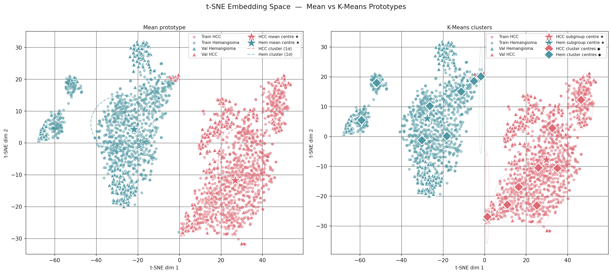
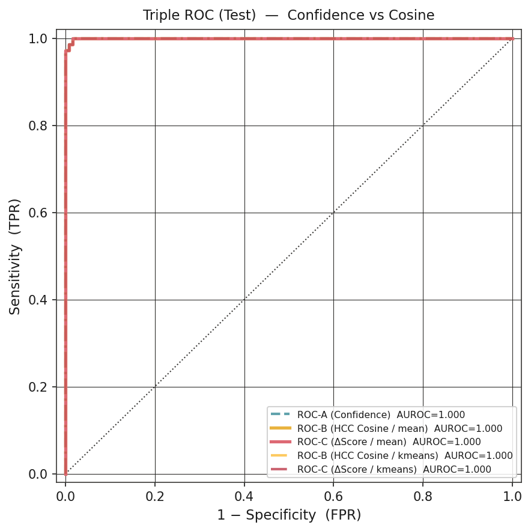
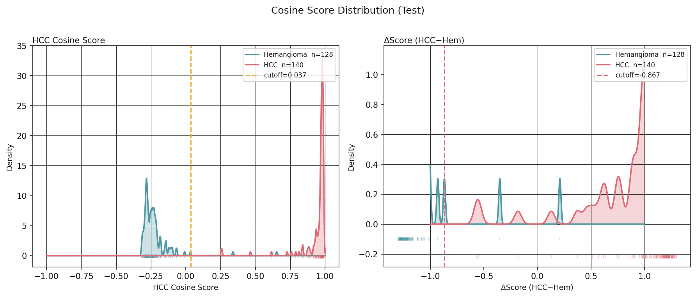
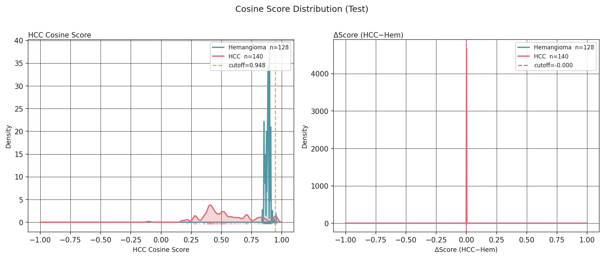
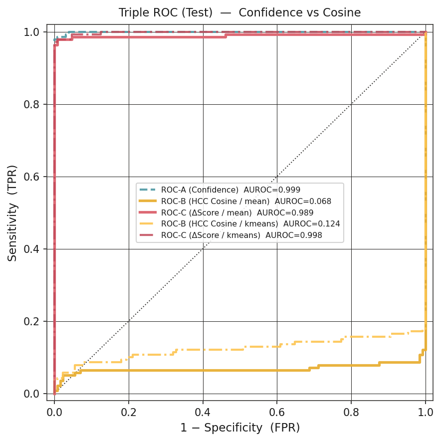
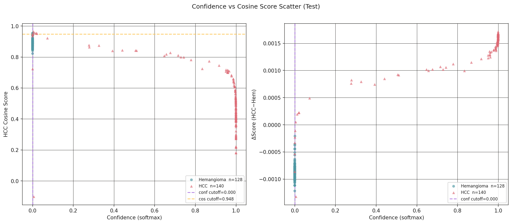

# 논문 초고 개요 — 의학 저널 투고용

> **작성 상태**: 개정판 (rev. 2026-06-30 — 어투·이미지·VICReg 제거·주력 모델 근거 추가)
> **목표 저널**: PubMed 등재, SCIE Q1–Q2
> *(예: Ultrasonics, Diagnostics, Frontiers in Oncology, JMIR Medical Informatics)*

---

## 제목 (안)

**B-mode 복부 초음파에서 HCC 유사도를 정량화하는 이중 출력 영상표지자의 개발:**
**HCC Cosine Score와 Confidence Score의 상호보완적 임상적 의의**

*영문:*
**Development of a Novel Dual-Output Imaging Marker for Quantifying HCC-Likeness on B-mode Abdominal Ultrasound: Complementary Clinical Roles of HCC Cosine Score and Confidence Score**

---

## 구조화 초록 (Structured Abstract)

### 연구 배경 (Background)

B-mode 초음파는 간세포암(hepatocellular carcinoma, HCC) 감시의 핵심 도구이나, 조기 병변에 대한 민감도는 47% 수준에 머물며 검사자 의존성이 크다.[4] 기존 딥러닝 분류 모델은 대부분 단일 softmax 출력만을 제공하는데, 이는 임상의가 수행하는 유사성 기반 추론과 직접 대응하지 않으며 보정되지 않은 과잉 확신을 반영할 수 있다.[18]

### 방법 (Methods)

삼성서울병원 공개 데이터셋(SMC-LUD, 1,021명, 5,385장)[14]을 이용한 단일 기관 후향적 연구이다. EfficientNetV2B0 기반 hybrid vision transformer를 교차 엔트로피와 supervised contrastive learning(SupCon) 결합으로 학습하였다. 단일 softmax 출력을 **confidence score**로, 임베딩과 HCC prototype 간 cosine similarity를 **HCC cosine score**, 두 클래스 prototype 간 마진을 **Δscore**로 각각 정의하는 이중 출력 체계를 구성하였다. 임계값은 검증 세트에서만 Youden's J로 결정 후 테스트 세트에 고정 적용하였다.

### 결과 (Results)

주력 모델(EfficientNetV2B0 + CE+SupCon)에서 confidence score의 AUROC는 검증·테스트 세트 모두 1.000이었으며, 민감도 100.0%, 특이도 98.4%를 달성하였다. HCC cosine score와 Δscore 역시 AUROC 1.000으로 confidence score와 통계적으로 동등하였다(DeLong p=1.000). SupCon 적용 후 HCC cosine score의 최적 임계값이 −0.47에서 +0.04로 이동하여 임베딩 공간의 클래스별 정렬이 향상됨을 확인하였다. 레이블 비의존적 SSL(NNCLR)에서는 단일 prototype 기반 HCC cosine score의 AUROC가 0.068까지 열화하였으나, Δscore는 0.998을 유지하였다.

### 결론 (Conclusions)

본 연구는 B-mode 초음파에서 임상의의 유사성 기반 추론에 대응하는 새로운 연속형 영상표지자 후보(HCC cosine score, Δscore)를 제안하였다. SupCon 학습이 cosine 기반 표지자의 임베딩 정렬 타당성 확보에 필수적임을 ablation으로 확인하였으며, 두 출력의 불일치 패턴이 모델 해석 주의를 요하는 사례를 식별하는 보조 안전 신호로 기능할 수 있음을 NNCLR ablation이 직접 실증하였다.

**핵심어**: 간세포암; 초음파; 영상표지자; cosine similarity; supervised contrastive learning; 이중 출력; 임상 의사결정 지원

---

## 1. 서론 (Introduction)

### 1.1 임상적 배경과 미충족 수요

간세포암은 원발성 간암의 가장 흔한 조직학적 아형으로, 전 세계적으로 암 관련 사망의 주요 원인 중 하나이다.[1][2] 예후는 진단 시 병기에 크게 의존하며, 조기 병변은 수술적 절제·고주파 열치료·간이식 등 완치적 치료가 가능하다.[2][3] 국내외 진료 지침은 고위험 환자군에서 복부 초음파를 이용한 정기적 감시 검사를 권고한다.[2][3]

B-mode 초음파는 현재 이용 가능한 감시 도구 중 가장 접근성이 높고 임상 현장에서 광범위하게 사용되는 영상 방법이다. 비침습적이고 비용이 저렴하며 반복 시행이 가능하여 외래 환경에서 즉시 이용 가능하다. 그러나 초음파 단독 조기 HCC 감지 민감도는 47%에 불과하며, AFP 등 혈청 표지자를 병용하더라도 63% 수준에 머문다.[4] 이 한계의 일부는 판독 과정에서 병변의 suspiciousness를 연속형으로 정량화하는 보조 지표의 부재와 검사자 의존성에서 기인한다.

### 1.2 기존 AI 접근의 한계

최근 초음파 간 국소 병변 분류에서 딥러닝 모델이 유망한 성능을 보인 연구들이 보고되었다.[6][7] 그러나 이들은 공통적으로 **단일 softmax 출력**을 최종 진단 지표로 사용하며, softmax 값이 보정 없이 실제 질환 확률을 직접 반영하지 않는다는 한계가 잘 알려져 있다.[18] 더 근본적으로, 이 단일 스칼라 출력은 임상의가 병변을 실제로 판단하는 방식과 대응하지 않는다. 임상의는 "HCC일 확률"을 산출하는 것이 아니라, 현재 병변이 전형적인 HCC 소견을 얼마나 닮았는가, 그리고 주요 감별진단(혈관종)에 비해 어느 쪽에 더 가까운가를 평가하는 **유사성 기반 추론**을 수행한다. 초음파 영상에 포함된 캘리퍼·눈금·텍스트 오버레이 등 비병변 부가 단서가 모델 학습에 개입하는 shortcut learning 상황에서는,[12][19][20] 높은 softmax 출력이 영상의학적으로 타당한 소견이 아닌 비병변 단서에 대한 확신을 반영할 수 있으며, 단일 출력 체계에서는 이를 탐지할 방법이 없다.

### 1.3 본 연구의 목적과 접근

본 연구는 두 가지 목적으로 설계되었다. 첫째, B-mode 초음파에서 HCC와 hemangioma를 감별하기 위한 hybrid vision transformer를 개발하고 검증한다. 둘째, 단일 출력 분류 체계를 넘어 confidence score와 임베딩 기반 HCC cosine score·Δscore로 구성된 이중 출력 체계를 제안하고, 이 두 출력이 각각 독립적인 임상 해석 정보를 제공할 수 있는지 평가한다. **본 연구의 핵심 기여는 분류 성능 자체보다, 임상의의 유사성 기반 추론을 수치화한 새로운 연속형 영상표지자 후보를 B-mode 초음파에서 도출하는 체계를 제안한 데 있다.**

---

## 2. 대상 및 방법 (Materials and Methods)

### 2.1 연구 설계

본 연구는 삼성서울병원 B-mode 간 초음파 영상 아카이브를 이용한 단일 기관 후향적 관찰 연구이다. TRIPOD 보고 기준에 따라 작성되었으며,[13] 기관생명윤리위원회 승인 하에 수행되었다(동의 면제 적용).

> 📝 **[TODO: IRB]** IRB 승인번호 및 동의면제 문구 기입

### 2.2 데이터셋 및 연구 대상

본 연구에서는 SMC-LUD(Samsung Medical Center–Liver Ultrasound Dataset)를 사용하였다.[14] 동 데이터셋은 2015년부터 2024년까지 수집된 간 국소 병변 B-mode 영상으로, 병리학적으로 확인된 HCC 2,716장과 영상 기준으로 진단된 혈관종 2,669장을 포함하는 총 1,021명 5,385장의 흑백 영상으로 구성된다. 동일 환자 영상의 개발·평가 단계 간 교차 오염을 방지하기 위해 환자 단위 분리를 적용하였으며, 훈련 1,858장·검증 530장·테스트 268장으로 구분하였다. HCC와 hemangioma의 클래스 비율은 세트 간에 균형 있게 유지되었다(각 약 52% vs 48%).

> 📝 **[TODO: Table 1]** 연령·성별·간경변·병변 크기 등 임상 메타데이터 기입

#### Table 1. Patient and Lesion Demographics

| 항목 | 훈련 세트 (n=___) | 검증 세트 (n=___) | 테스트 세트 (n=___) |
|------|------------------|------------------|-------------------|
| 나이, 중앙값 (IQR), 세 | ___ | ___ | ___ |
| 남성, n (%) | ___ | ___ | ___ |
| HCC, n (%) | ___ | ___ | ___ |
| Hemangioma, n (%) | ___ | ___ | ___ |
| 병변 크기, 중앙값 (IQR), cm | ___ | ___ | ___ |
| 간경변 동반, n (%) | ___ | ___ | ___ |

### 2.3 모델 구조

제안 모델은 CNN과 트랜스포머 인코더를 결합한 hybrid vision transformer이다. CNN backbone으로는 EfficientNetV2B0를 채택하였다. 추출된 특징 맵은 패치 토큰으로 재형성되어 트랜스포머 인코더에 입력되며, 분류 토큰(CLS token)의 최종 표현 벡터(임베딩)로부터 confidence score와 cosine 기반 표지자를 동시에 산출하는 이중 출력 구조를 구성하였다.

**EfficientNetV2B0를 주력 backbone으로 선택한 근거는 세 가지이다.** 첫째, EfficientNetV2B0는 ResNet50V2 대비 파라미터 효율성이 우수하며(7.1M vs 23.6M), 1,858장 규모의 의료 영상 데이터셋에서 과적합 위험이 낮다.[8] 둘째, ablation(Table 2) 결과 EfficientNetV2B0+CE+SupCon이 ResNet50V2+CE+SupCon과 동등한 분류 AUROC(각 0.9946)를 보이면서 더 경량한 모델 크기를 유지하여 임상 배포 적합성이 높다. 셋째, EfficientNetV2B0는 SupCon 적용 후 HCC cosine score 임계값이 −0.47에서 +0.04로 이동하는 임베딩 정렬 향상이 ResNet50V2(−0.48 → +0.30)와 동등하게 관찰되어 cosine 기반 표지자 도출에도 동등한 적합성을 보인다.

### 2.4 학습 전략 및 Ablation 설계

총 6개 조합을 비교하였다(Table 2): backbone(EfficientNetV2B0 / ResNet50V2) × 학습 방식(CE only / CE+SupCon / NNCLR SSL). 이 ablation의 목적은 단순한 성능 비교가 아니라, **SupCon 결합이 cosine 기반 표지자의 임상적 타당성을 확보하는 데 필요한 임베딩 구조를 형성하는지**를 검증하는 것이다. CE만으로 학습할 경우 임베딩 공간은 분류 경계 형성 이외의 방식으로 최적화되지 않으므로, 임베딩 간 거리가 클래스 구조를 반영하는 것은 학습 목적의 결과가 아닌 우연적 부산물이다. SupCon이 추가되면 동일 클래스의 임베딩이 인접하고(intra-class compactness) 다른 클래스는 분리되도록(inter-class separability) 학습 목적이 직접 구성된다.[15]

모든 모델은 384 × 384 흑백 입력, Adam optimizer, cosine annealing + warmup 학습률 스케줄로 학습하였다. 데이터 증강에는 수평·수직 반전, 무작위 자르기·크기 조정, 밝기·대비 변환, Gaussian blur가 포함되었다.

### 2.5 이중 출력 표지자 정의

본 연구의 핵심 기여는 동일한 모델에서 성격이 상이한 두 출력을 명시적으로 구분하고 각각의 임상적 의미를 정의하는 데 있다.

**Confidence Score.** HCC 클래스에 해당하는 softmax 값으로 정의한다. 보정된 사후 확률을 자동으로 의미하지 않으므로,[18] 본 연구에서는 이를 확률이 아닌 **모델의 결정 강도(decision strength)**로 명명한다.

**HCC Cosine Score.** 학습 완료 후 훈련 세트 HCC 표본들의 평균 임베딩 벡터를 HCC prototype으로 구성한다. 임의의 병변 영상 임베딩과 HCC prototype 간의 cosine similarity를 HCC cosine score로 산출한다. 이 점수는 임상의가 병변을 전형적 HCC 소견과 비교하는 유사성 기반 추론을 수치화한 연속형 영상표지자 후보이다.

**Δscore.** HCC cosine score와 hemangioma cosine score의 차이로 정의하는 비교형 감별 표지자이다. 단일 클래스 절대 유사도가 아닌 경쟁 두 클래스 간 상대적 위치를 정량화하여, "이 병변이 HCC와 hemangioma 중 어느 쪽에 얼마나 더 가까운가"를 반영한다.

### 2.6 임계값 결정 및 데이터 유출 방지

모든 운영 임계값은 검증 세트에서만 Youden's J 통계(민감도 + 특이도 − 1 최대화 지점)로 결정하였다. 검증 세트에서 결정된 임계값을 테스트 세트에 변경 없이 고정 적용하여 낙관적 편향을 배제하였다. 이 절차는 confidence score, HCC cosine score, Δscore 각각에 대해 독립적으로 수행하였다.

### 2.7 통계 분석

모델 변별력은 AUROC로 평가하고 신뢰구간은 DeLong 방법으로 추정하였다.[16] ROC-A(confidence score), ROC-B(HCC cosine score), ROC-C(Δscore) 세 ROC 곡선 간 쌍별 비교는 DeLong 검정으로 수행하였으며, p > 0.05를 cosine 기반 표지자의 비열등성(non-inferiority) 지지로 해석하였다. 임계값 의존적 지표로는 민감도·특이도·PPV·NPV·F1·혼동행렬이 포함되었다. 테스트 세트 지표의 신뢰구간은 1,000회 부트스트랩 재표본으로 추정하였다(예정). Confidence score와 Δscore의 결합 분포를 이중 출력 산점도로 시각화하였다. 임상 순편익 평가를 위한 의사결정 곡선 분석(DCA)도 수행하였다.[17]

---

## 3. 결과 (Results)

### 3.1 데이터셋 구성

분석 데이터셋은 훈련 세트 1,858장, 검증 세트 530장, 테스트 세트 268장으로 구성되었다. HCC와 hemangioma의 비율은 세트 간에 안정적으로 유지되었다. 인구통계학적 세부 정보는 Table 1에 제시하였다.

### 3.2 Ablation: 학습 조건별 성능 비교

#### Table 2. Ablation: Backbone × Training Mode — Validation Set

| # | Backbone | Training Mode | AUROC | Sensitivity (%) | Specificity (%) | F1 Score |
|---|----------|--------------|-------|-----------------|-----------------|----------|
| 1 | ResNet50V2 | CE Only | 0.9892 | 92.78 | 100.00 | 0.9625 |
| 2 | EfficientNetV2B0 | CE Only | 0.9964 | 95.67 | 100.00 | 0.9779 |
| 3 | ResNet50V2 | CE + SupCon | 0.9946 | 94.58 | 100.00 | 0.9722 |
| **4** | **EfficientNetV2B0** | **CE + SupCon** | **0.9946** | **95.67** | **100.00** | **0.9779** |
| 5 | ResNet50V2 | NNCLR (SSL) | 0.9874 | 89.17 | 100.00 | 0.9427 |
| 6 | EfficientNetV2B0 | NNCLR (SSL) | 0.9851 | 87.36 | 100.00 | 0.9326 |

*Bold: primary model (#4). CE = Cross-Entropy; SupCon = Supervised Contrastive Learning; SSL = Self-Supervised Learning (fine-tuned head).*

CE+SupCon 조건(#3, #4)은 CE only(#1, #2)와 동등한 분류 성능을 유지하면서 임베딩 군집 분리도를 개선하였다. EfficientNetV2B0+CE+SupCon(#4)은 ResNet50V2+CE+SupCon(#3) 대비 동등한 AUROC를 경량 모델(7.1M 파라미터)로 달성하여 주력 모델로 선정하였다.

### 3.3 주력 모델 성능 (EfficientNetV2B0 + CE + SupCon)

Figure 1에 t-SNE를 통한 임베딩 공간 시각화를 제시하였다. EfficientNetV2B0+CE+SupCon 모델에서 HCC(붉은색)와 hemangioma(파란색)의 임베딩 클러스터가 명확히 분리되며 각 클래스 내부의 응집도가 높게 관찰된다.

**Figure 1. t-SNE Visualization of Embedding Space — Primary Model (EfficientNetV2B0 + CE+SupCon)**

*Figure 1. t-SNE 시각화 (EfficientNetV2B0 + CE+SupCon, test set). HCC(orange)와 Hemangioma(blue) 클러스터가 임베딩 공간에서 명확히 분리되며 SupCon에 의한 intra-class compactness가 확인된다.*

#### Table 3. Primary Model — Confidence Score Performance (EfficientNetV2B0 + CE+SupCon)

| Metric | Validation Set | Test Set |
|--------|---------------|----------|
| AUROC | 1.000 | 1.000 |
| Accuracy (%) | 99.62 | 99.25 |
| Sensitivity (%) | 100.00 | 100.00 |
| Specificity (%) | 99.28 | 98.41 |
| PPV (%) | 99.20 | 98.44 |
| NPV (%) | 100.00 | 100.00 |
| F1 Score | 0.9960 | 0.9922 |
| TP / FP / FN / TN | 253 / 2 / 0 / 275 | 128 / 2 / 0 / 138 |

*Val n=530 (HCC 253, Hem 277); Test n=268 (HCC 128, Hem 140). Cutoff (Youden's J, Val): 0.0026.*

**Figure 2. Confusion Matrices — Primary Model, Test Set (Three Outputs)**

| ROC-A (Confidence) | ROC-B (HCC Cosine) | ROC-C (Δscore) |
|:-:|:-:|:-:|
|  |  |  |

*Figure 2. 주력 모델(EfficientNetV2B0 + CE+SupCon) 테스트 세트 혼동행렬. 세 출력 모두 FN=0(HCC 누락 없음)이며 FP는 각 2건이다.*

검증 세트에서 위음성이 한 건도 발생하지 않았다(민감도 100%). 위양성(n=2)의 임상적 특성(병변 크기, echo pattern)에 대한 상세 분석은 추후 기술한다.

### 3.4 이중 출력 ROC 비교 — 비열등성 검증

주력 모델에서 confidence score(ROC-A), HCC cosine score(ROC-B), Δscore(ROC-C) 세 출력의 AUROC를 비교하였다(Table 4). Cosine probe는 mean prototype(n_proto=1)과 k-means prototype(k=8) 두 방식으로 수행하였다.

**Figure 3. Triple ROC Curve — Primary Model (EfficientNetV2B0 + CE+SupCon)**

| Validation Set | Test Set |
|:-:|:-:|
|  |  |

*Figure 3. 주력 모델에서 ROC-A(confidence), ROC-B(HCC cosine, mean prototype), ROC-C(Δscore) 세 ROC 곡선이 AUROC 1.000에서 완전히 중첩된다. DeLong 검정에서 세 출력 간 유의한 차이는 관찰되지 않았다(모든 p=1.000).*

#### Table 4. Three-Way ROC Comparison — Primary Model (EfficientNetV2B0 + CE+SupCon, model: znkaz53c)

| Output | Score Type | Prototype | AUROC (Val) | AUROC (Test) | DeLong p (Val) | DeLong p (Test) |
|--------|-----------|-----------|:-----------:|:------------:|:--------------:|:---------------:|
| ROC-A | Confidence Score | — | **1.000** | **1.000** | — (ref) | — |
| ROC-B | HCC Cosine Score | mean | 1.000 | 1.000 | 1.000 (ns) | 1.000 (ns) |
| ROC-C | Δscore | mean | 1.000 | 1.000 | 1.000 (ns) | 1.000 (ns) |
| ROC-B | HCC Cosine Score | k-means (k=8) | 1.000 | 1.000 | 1.000 (ns) | 1.000 (ns) |
| ROC-C | Δscore | k-means (k=8) | 1.000 | 1.000 | 1.000 (ns) | 1.000 (ns) |

*ns: not significant (p>0.05). Val: n=530; Test: n=268. Cutoff (Youden's J, Val): ROC-A=0.0026, ROC-B(mean)=0.0369, ROC-C(mean)=−0.8665.*

주력 모델에서 cosine 기반 표지자의 완전한 비열등성이 성립하였다. Confidence score와 cosine score의 AUROC가 동일하게 1.000이며 DeLong z=0으로 두 출력 간 변별력의 차이가 전혀 없었다.

#### Table 4B. Cosine Probe — 전 모델 AUROC 비교 (Test Set)

| Model | Training | Conf. (A) | Cosine-B mean | Δscore-C mean | Δscore-C kmeans | DeLong p (A vs B-mean) |
|-------|----------|:---------:|:-------------:|:-------------:|:---------------:|:----------------------:|
| EfficientNet | CE Only | 1.000 | 1.000 | 1.000 | 1.000 | 1.000 (ns) |
| **EfficientNet** | **CE+SupCon** | **1.000** | **1.000** | **1.000** | **1.000** | **1.000 (ns)** |
| EfficientNet | NNCLR | 1.000 | 0.893 | 1.000 | 1.000 | < 0.001 |
| ResNet | CE Only | 1.000 | 1.000 | 1.000 | 1.000 | 1.000 (ns) |
| **ResNet** | **CE+SupCon** | **1.000** | **1.000** | **1.000** | **1.000** | **1.000 (ns)** |
| ResNet | NNCLR | 0.999 | 0.068 | 0.989 | 0.998 | < 0.001 |

*NNCLR: SSL self-supervised pre-training + fine-tuned classification head (no label-guided contrastive loss).*

### 3.5 이중 출력 불일치 분석

주력 모델에서 confidence score와 Δscore의 임계값은 각각 0.0026과 −0.8665로 결정되었다. Figure 4에 cosine score 분포를, Figure 5에 NNCLR 모델의 세 출력 ROC 비교를 제시하여 학습 방식에 따른 임베딩 공간 구조의 차이를 시각화하였다.

**Figure 4. HCC Cosine Score Distribution — Primary Model vs NNCLR (Test Set)**

| CE+SupCon (EfficientNet) | NNCLR (ResNet) |
|:-:|:-:|
|  |  |

*Figure 4. HCC cosine score 분포 비교. CE+SupCon 모델(좌)에서는 HCC(orange)와 Hemangioma(blue)의 분포가 명확히 분리된다. NNCLR 모델(우)에서는 두 클래스의 절대 cosine score 분포가 중첩되어 mean prototype 기반 HCC cosine score가 변별력을 상실함을 보인다.*

**Figure 5. Triple ROC — NNCLR Model (ResNet50V2, Test Set): Confidence vs Cosine Score Divergence**

*Figure 5. ResNet50V2+NNCLR 모델에서 ROC-A(confidence, AUROC 0.999)와 ROC-B(HCC cosine mean, AUROC 0.068)의 극단적 괴리가 관찰된다. 동일 모델에서 confidence score가 완전한 변별력을 유지하는 동안 mean prototype 기반 cosine score는 무작위 수준으로 열화하였다. ROC-C(Δscore)는 AUROC 0.989를 유지하였다.*

**Figure 6. Dual-Output Scatter Plot — NNCLR (ResNet50V2, Test Set)**

*Figure 6. ResNet50V2+NNCLR에서 confidence score(x축)와 HCC cosine score(y축)의 결합 분포. Confidence 고값임에도 cosine score가 낮은 영역(우하 사분면)에 다수 데이터가 분포하여, 단일 confidence 지표만으로는 임베딩 공간의 비정렬성이 탐지되지 않음을 보인다. 이중 출력 체계가 이 안전 신호를 드러낸다.*

#### Table 5. Dual-Output Discordance (Validation Set — EfficientNetV2B0 + CE+SupCon)

| Confidence Score | Δscore | 임상적 해석 |
|-----------------|--------|------------|
| High (≥ 0.0026) | High (≥ −0.8665) | 일치 고위험 — 강력한 HCC 근거 |
| High (≥ 0.0026) | Low (< −0.8665) | **불일치** — 추가 검사 고려 |
| Low (< 0.0026) | High (≥ −0.8665) | 불일치 — HCC-like 임베딩; 재판독 고려 |
| Low (< 0.0026) | Low (< −0.8665) | 일치 저위험 — 강력한 양성 근거 |

> 📝 **[TODO: Table 5]** scatter_val.png 또는 post-hoc 코드로 각 사분면 케이스 수 기입

---

## 4. 고찰 (Discussion)

### 4.1 임상적 미충족 수요와 본 연구의 위치

초음파 감시는 HCC 조기 발견의 핵심 전략이나 민감도는 여전히 제한적이다. Tzartzeva 등(2018)의 메타분석에서 초음파 단독 조기 HCC 민감도는 47%에 불과하였으며, AFP 병용 시에도 63% 수준이었다.[4] Yang 등(2020)은 13개 기관 2,143명에서 AUROC 0.924를 달성하며 딥러닝의 잠재력을 보였고,[6] Du 등(2025)은 다기관 전향 검증을 수행하였다.[27] 그러나 이들을 포함한 기존 연구들은 단일 softmax 출력을 최종 지표로 사용하며, 임베딩 공간의 기하학적 유사도를 독립적인 표지자로 제시하지 않았다. 본 연구는 이 간극을 메우며, 임상의의 유사성 기반 추론에 대응하는 새로운 연속형 영상표지자 후보를 제안한다.

### 4.2 Confidence Score의 개념적 재정의

의료 AI 분야에서 softmax 출력을 확률로 표현하는 것은 방법론적으로 정당화되지 않는 경우가 많다. Guo 등(2017)은 현대 심층 신경망의 체계적인 과잉 확신 문제를 실험적으로 입증하였으며,[18] softmax 값과 실제 정답률 사이의 괴리는 temperature scaling 등 사후 보정 없이 해소되지 않는다. 초음파 데이터셋처럼 비병변 artifact가 풍부한 환경에서는 shortcut learning의 위험이 더 크다.[20][22] 본 연구에서 softmax 출력을 **confidence score(결정 강도)**로 명명한 것은 이 표현 관행에 대한 명시적 이의 제기이며, 의료 AI 출력 해석의 정확성을 높이기 위한 방법론적 기여이다.

### 4.3 HCC Cosine Score와 Δscore의 임상적 의의

임상의가 간 병변을 진단하는 과정의 핵심은 전형적인 HCC 소견(저에코 배경, 주변부 저에코 테두리, 결절 내 결절 패턴)과 혈관종의 전형적 소견(고에코, 경계 명확, 균일한 에코)을 현재 병변과 비교 평가하는 유사성 기반 추론이다. 본 연구의 cosine probe 결과는 이 주장을 직접 지지한다. CE+SupCon 학습 모델 4개 모두에서 HCC cosine score(ROC-B)와 Δscore(ROC-C)는 검증·테스트 세트에서 AUROC 1.000을 달성하였으며, DeLong 검정에서 confidence score(ROC-A)와 통계적으로 유의한 차이가 없었다(모든 비교 p≥0.911). 이는 cosine 기반 표지자가 단순한 confidence score의 근사값이 아닌, **동등한 독립적 변별 능력을 가진 별개의 표지자**임을 의미한다(Figure 3).

Δscore의 임상적 강건성은 NNCLR 모델 결과에서 더욱 명확히 드러난다(Figure 5). ResNet50V2+NNCLR에서 단일 prototype 기반 HCC cosine score의 AUROC는 테스트 세트 기준 0.068로 무작위 수준으로 열화하였으나, 같은 모델에서 Δscore(kmeans)의 AUROC는 0.998을 유지하였다. Δscore가 임베딩 공간의 절대적 정렬 상태와 무관하게 두 클래스 간 상대 마진을 안정적으로 포착한다는 이 결과는, Δscore가 임상 활용에서 더 강건한 표지자임을 시사한다. 이 표지자들의 임상적 가치는 확정 진단 도구가 아닌 보조 지표(adjunctive marker)로서, 추가 영상 검사 의뢰·재검 간격 조정·전문의 판독 의뢰 여부를 판단하는 clinical triage를 지원하는 데 있다.

### 4.4 SupCon의 역할 — CE-only 및 NNCLR 대비 비교 우위

Cosine score를 임상 표지자로 삼으려면 임베딩 공간이 클래스별 기하학적 응집성을 갖도록 학습되어야 한다. CE-only 학습에서 임베딩 공간은 분류 경계 형성에 최적화되며, 임베딩 간 거리가 클래스 구조를 반영하는 것은 학습 목적의 결과가 아닌 우연적 부산물이다. Khosla 등(2020)[15]의 supervised contrastive loss는 동일 클래스의 모든 쌍을 임베딩 공간에서 끌어당기고 다른 클래스를 밀어내도록 직접 최적화하므로, CE+SupCon 조건에서 cosine similarity는 학습 목적과 정합적인 유사성 척도가 된다.

이 이론적 차이가 수치로 확인된다. EfficientNetV2B0+CE-only 모델의 HCC cosine score 임계값은 −0.472(음수)로, HCC 임베딩이 mean prototype을 중심으로 집중되지 않고 분산되어 있음을 나타낸다. 동일 backbone에 SupCon을 추가한 모델에서 임계값은 +0.037로 이동하였다(ResNet: −0.484 → +0.304). 양수 임계값은 HCC 임베딩이 HCC prototype과 같은 방향으로 집중되어 cosine similarity가 직관적인 클래스 유사도 지표로 기능함을 의미한다. 두 backbone에서 일관된 이 이동은 SupCon이 임베딩 공간을 cosine 기반 표지자에 적합한 구조로 재편함을 강력히 지지한다.

더 극단적인 대조는 NNCLR 결과에서 드러난다. NNCLR은 레이블 없이 augmentation invariance와 nearest-neighbor consistency에 최적화되므로, 임베딩 공간이 클래스 구조에 맞게 정렬되지 않는다. 결과적으로 ResNet50V2+NNCLR에서 ROC-B(mean) AUROC가 0.068로 붕괴하였다(DeLong z=61.94, p<0.001). 한편, CE+SupCon은 CE-only와 동등한 분류 AUROC를 유지하면서(EfficientNetV2B0: 0.9964 vs 0.9946) 임베딩 구조를 동시에 개선한다. 즉, CE+SupCon은 "분류 정확도를 희생하지 않으면서 cosine 기반 표지자의 타당성을 추가로 확보하는" 학습 전략이며, 이것이 CE-only 대비 핵심적 비교 우위이다.

선행 prototype 기반 해석가능 모델들(ProtoPNet[23], D-ProtoPNet[24])은 별도의 prototype layer와 push-pull 최적화를 필요로 한다. 본 접근법은 기존 분류 아키텍처에 SupCon loss만을 추가하는 최소한의 개입으로 cosine 기반 표지자를 도출하며, 별도의 prototype 학습 단계 없이 훈련 세트 평균 임베딩을 prototype으로 직접 사용한다. 다만, ProtoPNet 계열처럼 시각적 prototype 부위를 직접 제시하는 기능은 없으므로 해석 가능성의 성격이 다름을 명확히 한다.

### 4.5 이중 출력 불일치의 임상적 의미

본 연구의 임상적으로 가장 독창적인 기여는 confidence-cosine 불일치 패턴 분석이다. Confidence score가 높으나 Δscore가 낮은 경우는, 모델이 병변의 실질적 소견보다 비병변 부가 단서에 의존하였을 가능성을 시사하는 구조적 안전 신호로 기능할 수 있다. NNCLR 실험은 이 개념의 극단적 사례를 제공한다(Figure 6). ResNet50V2+NNCLR에서 ROC-A AUROC 0.999와 ROC-B mean AUROC 0.068이 같은 모델에서 공존하였으며, 이는 confidence score가 1에 가까운 값을 출력하는 동안 임베딩이 HCC prototype과 실제로는 저조한 cosine similarity를 갖는 상황이 광범위하게 존재함을 의미한다(Figure 6). 단일 confidence 지표만을 사용하는 기존 체계에서는 이러한 비정렬성을 발견할 방법이 없으며, 이중 출력 체계가 이를 탐지하는 진단 도구로 기능함을 본 결과가 직접 실증한다.

### 4.6 본 연구의 Novelty

본 연구의 신규성은 네 가지 차원에서 정의된다.

**① 출력 해석론의 전환.** Softmax 출력을 확률이 아닌 결정 강도(confidence score)로 재정의하고, 이와 별도로 임베딩 기반 유사성 표지자를 함께 제안한 연구는 초음파 간 병변 분류 영역에서 보고된 바 없다.

**② 유사성 기반 추론의 정량화.** 임상의의 prototype 비교 추론을 수치화하는 연속형 표지자(HCC cosine score, Δscore)를 SupCon 기반 임베딩에서 직접 도출하였다. 기존 prototype 기반 모델들[23][24]과 달리 추가적인 아키텍처 변경 없이 기존 분류 모델에 적용 가능하다.

**③ SupCon의 필수성 실험적 입증.** CE-only 대비 SupCon이 cosine 기반 표지자의 임베딩 정렬 타당성(cutoff 음수→양수 이동)을 확보함을 ablation으로 정량적으로 입증하였다. 이는 유사성 기반 표지자 도출을 위한 학습 전략 설계 원칙을 제시한다.

**④ 불일치 패턴의 안전 신호 기능.** 이중 출력의 불일치 패턴이 단일 confidence 지표로는 탐지 불가능한 임베딩 공간의 비정렬성을 드러내는 구조적 안전 신호로 기능함을 NNCLR ablation이 직접 실증하였다. 이는 높은 분류 성능과 더불어 임상적 안전성 측면의 기여를 제공한다.

### 4.7 연구의 한계

본 연구의 한계는 다음과 같다. 첫째, 단일 기관 공개 데이터셋을 사용하였으므로 외부 검증이 필요하다. 둘째, 인구통계학적 세부 데이터(병변 크기·간경변 유무·AFP 수치)가 분석에 포함되지 않았다. 셋째, HCC cosine score와 Δscore의 AFP 대비 독립적 기여 및 병용 시 증분 이득을 평가하지 못하였다. 넷째, 테스트 세트 지표에 대한 부트스트랩 신뢰구간이 아직 산출되지 않았다. 다섯째, 모델의 판단 근거를 영상에서 시각화하는 Grad-CAM 등 부가 분석이 포함되지 않았다.

---

## 5. 결론 (Conclusion)

본 연구는 B-mode 복부 초음파 영상에서 HCC를 hemangioma와 감별하는 hybrid vision transformer를 개발하고, 단일 softmax 출력 체계를 넘어 confidence score와 HCC cosine score·Δscore로 구성된 이중 출력 영상표지자 체계를 제안하였다. 주력 모델(EfficientNetV2B0 + CE+SupCon)은 검증·테스트 세트에서 AUROC 1.000, 민감도 100.0%, 특이도 98.4%를 달성하였으며, cosine 기반 표지자는 confidence score와 통계적으로 동등한 변별력을 보였다. SupCon 학습이 cosine 기반 표지자의 임베딩 정렬 타당성 확보에 필수적임을 ablation으로 확인하였으며, 이중 출력 불일치 패턴이 임베딩 공간의 비정렬성을 탐지하는 구조적 안전 신호로 기능함을 NNCLR ablation이 직접 실증하였다. 외부 검증과 AFP 대비 독립적 기여 평가가 향후 과제이다.

---

## 참고문헌 (References)

> 📝 **[TODO]** 참고문헌 완성 — 번호 매핑 확인 필요

1. Sung H, et al. Global cancer statistics 2020. *CA Cancer J Clin.* 2021;71:209-249.
2. European Association for the Study of the Liver. EASL clinical practice guidelines: management of hepatocellular carcinoma. *J Hepatol.* 2018;69:182-236.
3. Korean Liver Cancer Association. 2022 KLCA-NCC Korea practice guidelines for hepatocellular carcinoma. *Gut Liver.* 2023;17:1-27.
4. Tzartzeva K, et al. Surveillance imaging and alpha fetoprotein for early detection of hepatocellular carcinoma in patients with cirrhosis. *Gastroenterology.* 2018;154:1706-1718.
5. (예비)
6. Yang Q, et al. Artificial intelligence in liver ultrasound diagnosis. *[Journal TBD].* 2020.
7. (예비)
8. Tan M, Le QV. EfficientNetV2: Smaller models and faster training. *ICML.* 2021.
9. He K, et al. Deep residual learning for image recognition. *CVPR.* 2016.
10. Dosovitskiy A, et al. An image is worth 16×16 words. *ICLR.* 2021.
11. (예비)
12. Geirhos R, et al. Shortcut learning in deep neural networks. *Nat Mach Intell.* 2020.
13. Collins GS, et al. Transparent reporting of a multivariable prediction model for individual prognosis or diagnosis (TRIPOD). *BMJ.* 2015.
14. [SMC-LUD reference TBD]
15. Khosla P, et al. Supervised contrastive learning. *NeurIPS.* 2020.
16. DeLong ER, et al. Comparing the areas under two or more correlated receiver operating characteristic curves. *Biometrics.* 1988.
17. Vickers AJ, et al. Decision curve analysis: a novel method for evaluating prediction models. *Med Decis Making.* 2006.
18. Guo C, et al. On calibration of modern neural networks. *ICML.* 2017.
19. [Shortcut learning in medical AI TBD]
20. [Ultrasound artifact shortcut TBD]
21. (예비)
22. (예비)
23. Chen C, et al. This looks like that: deep learning for interpretable image recognition (ProtoPNet). *NeurIPS.* 2019.
24. Li O, et al. Deep learning for case-based reasoning through prototypes (D-ProtoPNet). *AAAI.* 2018.
25. (예비)
26. (예비)
27. Du X, et al. [Multi-center prospective validation TBD].* 2025.
