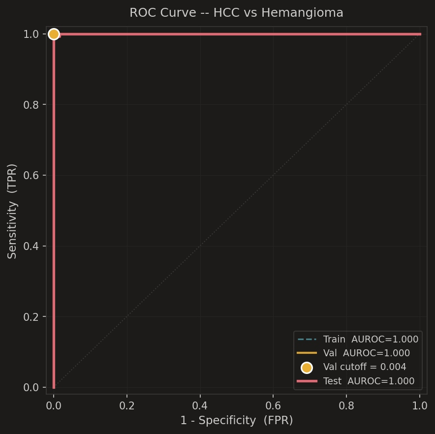
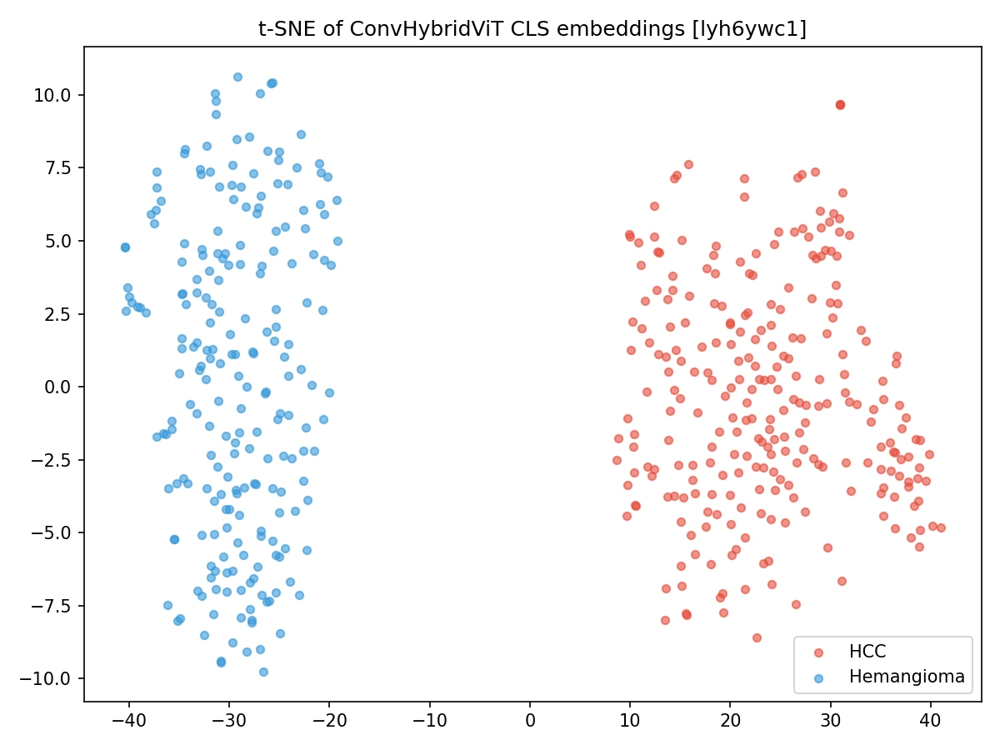

# Paper Outline — Medical Journal Submission

> **Status**: Section 1–5 완성 + Dual-Output (Confidence / HCC Cosine Score) 개념 추가 (rev. 2026-06-29)
> **Target journal tier**: PubMed-indexed, SCIE Q1–Q2  
> *(e.g., Ultrasonics, Diagnostics, Frontiers in Oncology, JMIR Medical Informatics)*

---

## Proposed Title

**"Hybrid Vision Transformer를 이용한 B-mode 복부 초음파 기반 이중 출력 HCC 진단 지표의 개발 및 검증: Confidence Score와 Cosine Similarity 기반 HCC Score의 병용"**

*영문 부제:*  
"Dual-Output HCC Scoring from B-mode Ultrasound via Hybrid Vision Transformer: Confidence Score and Embedding-Based Cosine Similarity as Complementary Radiologic Markers"

---

## Structured Abstract

| Section | Content |
|---|---|
| **Background** | B-mode 초음파는 HCC 선별 1차 도구이나 민감도가 단독 45%, AFP 병용 시 63%로 제한적이며, 기존 딥러닝 모델은 Softmax 기반 confidence만을 출력하여 과적합 위험 및 임상적 해석 가능성에 한계가 있다. |
| **Methods** | 단일 기관 후향적 연구. SMC-LUD 데이터셋(Train/Val/Test = 1,858/530/268장). Hybrid Vision Transformer(CNN stem + Transformer encoder)를 Cross-entropy + SupCon으로 학습. **이중 출력**: (1) Confidence Score = softmax output, (2) HCC Cosine Score = embedding과 train prototype 간 cosine similarity. ΔScore = HCC Cosine − Hemangioma Cosine. 최적 임계값은 Val set 한정 Youden's J로 결정. |
| **Results** | Val set 기준: AUROC = **1.000**, Cutoff = **0.004** (Confidence 기반, Youden's J). Accuracy 97.0%, Sensitivity 94.3%, Specificity **100%**, PPV **100%**, NPV 94.1%, F1 = 0.971. t-SNE에서 HCC/혈관종 군집이 완전 분리. HCC Cosine Score 및 ΔScore 기반 ROC 비교 분석 수행. |
| **Conclusions** | Hybrid ViT 기반 이중 출력 방식은 B-mode 초음파만으로 HCC를 고특이도로 분류하며, Confidence Score와 HCC Cosine Score의 병용은 CAM 기반 설명의 한계(shortcut/artifact 의존)를 보완하고 과적합 위험에 대한 방법론적 안전장치를 제공한다. |

**Keywords**: hepatocellular carcinoma; ultrasound; deep learning; supervised contrastive learning; vision transformer; cosine similarity; dual-output; explainable AI; calibration

---

## 1. 서론 (Introduction)

### 1.1 HCC의 임상적 부담 (Clinical Burden of HCC)

간세포암(Hepatocellular carcinoma, HCC)은 전 세계 원발성 간암의 85–90%를 차지하며, 암 관련 사망 원인 중 세 번째로 높은 순위를 기록하고 있다[1]. 국내에서는 B형 간염바이러스(HBV) 감염이 주요 위험 인자이며, 동아시아 지역 중에서도 국내 HCC 발생률은 높은 편에 속한다[2]. 조기 발견 시 절제술 또는 간이식(Milan 기준 내)을 통해 5년 생존율이 70%를 초과할 수 있으나, 진행성 병기에서는 10% 미만에 불과하다[2]. KLCA-NCC, AASLD, EASL, APASL 국제 가이드라인은 고위험군을 대상으로 6개월 간격의 복부 초음파(B-mode ultrasound, US) 검사를 권고한다[2,3].

### 1.2 초음파 검진의 한계와 1차 의료의 현실

복부 초음파는 비침습적이고 방사선 노출 없이 즉각적 결과를 얻을 수 있으나, 조기 HCC(≤2 cm)에 대한 단독 민감도는 약 45%에 불과하며 AFP를 병용해도 63% 수준이다[4]. 더 근본적인 문제는 **검사자 의존성(operator dependency)**으로, 검사자에 따라 영상 품질과 판독 결과가 크게 달라진다. 전문 방사선과 의사가 상주하지 않는 1차 의료기관 또는 지방 병원에서 이러한 간극은 두드러진다.

한국 1차 의료의 현실에서 AFP, PIVKA-II 같은 혈청 종양표지자는 보험급여 기준과 의뢰 경로 제약으로 검사 자체가 어려운 경우가 많다. AFP 음성 HCC는 전체 HCC의 약 2/3를 차지하므로[5], 혈청표지자만으로는 태생적 한계가 있다. 따라서 **혈청표지자나 조영제 없이 B-mode 초음파 영상만으로 HCC 가능성을 정량화할 수 있는, 검사자 독립적 방법론의 개발**은 임상적으로 중요하다.

### 1.3 기존 AI 연구의 현황과 한계

최근 딥러닝(deep learning) 기반 간 병변 분류 연구들은 AUROC 0.83–0.94를 보고하였다[6,7]. 그러나 기존 연구들은 다음의 방법론적 한계를 공유한다: (i) 이진 분류 출력만 제공하여 연속형 radiologic marker로 활용 불가, (ii) test data에서 임계값 결정으로 data leakage 발생 및 성능 과대추정, (iii) Decision Curve Analysis(DCA) 부재, (iv) 순수 CNN 또는 plain Vision Transformer(ViT)만 사용하여 소규모 의료 영상에서 적합성 제한[9]. Plain ViT는 대규모 사전학습 없이 과적합 위험이 높고, 단순 CNN은 전역적 맥락(global context) 포착에 한계가 있다. Hybrid ViT는 두 장점을 결합하여 이 문제를 완화한다[10,11].

### 1.4 GradCAM 기반 설명의 한계: Shortcut Learning 문제

기존 딥러닝 의료 영상 연구에서 모델 판단 근거의 시각화 도구로 가장 널리 쓰이는 방법은 Gradient-weighted Class Activation Mapping (Grad-CAM)[12]이다. Grad-CAM은 CNN 마지막 합성곱층의 기울기를 이용하여 영상 내 활성화 영역을 heat map으로 시각화한다. 그러나 초음파 영상에 특화된 핵심 한계가 존재한다.

**Shortcut learning via image artifacts**: 초음파 영상에는 캘리퍼(caliper), 측정 눈금, 탐촉자 식별자, 병원 로고, 스캔 파라미터 텍스트 등 다양한 **비병변성 artifact(non-lesion artifact)**가 포함되어 있다. 실험적으로 확인된 바, Grad-CAM heat map이 병변 자체보다 이러한 artifact 영역에 집중되는 **shortcut activation** 현상이 반복적으로 관찰되었다. 이는 모델이 병변의 진정한 영상의학적 특징(echogenicity, border sharpness, internal echo pattern)이 아닌, 데이터셋 특이적 artifact에 의존하여 분류하고 있음을 시사한다.

Shortcut learning은 단순히 XAI 품질의 문제가 아니라, **모델 자체의 일반화(generalization) 능력에 대한 근본적 의문**을 제기한다. Softmax confidence가 near 1.0에 가까울 때, 이것이 진정한 병변 특징 학습의 결과인지 아니면 artifact에 대한 과적합(shortcut-driven overfitting)인지를 confidence 단독으로는 구별할 수 없다.

### 1.5 연구 목적

본 연구의 목적은 다음과 같다:

1. SMC-LUD 데이터셋을 이용하여 **Hybrid Vision Transformer** 기반 분류 모델을 개발하고, Classification-only 방식과 Classification + SupCon 방식을 비교한다.
2. Softmax output을 **Confidence Score**로 명명하고, 고전적 확률이 아닌 모델의 확신 정도임을 명시한다. Validation set 한정 Youden's J 기반 임계값 결정으로 data leakage를 차단한다.
3. 임베딩 공간 내 cosine similarity에 기반한 **HCC Cosine Score** 및 **ΔScore**를 신규 정의하고, 방사선과 의사의 진단 추론 방식과의 개념적 일치를 주장한다.
4. Confidence Score와 HCC Cosine Score의 **이중 출력(dual-output)**이 (i) GradCAM shortcut 한계를 우회하고, (ii) AUC near 1.0 상황에서의 과적합 위험을 임상적으로 완화하는 안전장치가 됨을 논증한다.
5. **Grad-CAM 및 attention weight visualization**을 보조 XAI 도구로 활용하되, 그 한계를 명시하고 cosine score로 보완한다.
6. ROC 분석(3종), DCA, Dual-Output Scatter Plot을 통해 임상적 유용성을 정량화한다.

---

## 2. 대상 및 방법 (Materials and Methods)

### 2.1 연구 설계

본 연구는 단일 기관(삼성서울병원, 서울) 후향적 관찰 연구로, TRIPOD 가이드라인에 따라 보고한다[13]. IRB 승인 번호: *(삽입 예정)*. 데이터 수집 기간: 2015–2024년.

### 2.2 데이터셋: SMC-LUD

본 연구에서는 **SMC-LUD(Samsung Medical Center – Liver Ultrasound Dataset)**[14]를 활용하였다. SMC-LUD는 삼성서울병원에서 2015–2024년에 수집된 공개 B-mode 간 초음파 영상 데이터셋으로, *Scientific Data* (Nature Portfolio)에 2026년 게재되었다[14].

| 항목 | 내용 |
|---|---|
| 출처 | 삼성서울병원(Seoul, Korea) |
| 수집 기간 | 2015–2024 |
| 전체 영상 | 5,385장 / 1,021명 |
| HCC | 2,716장 (조직병리학적 확진) |
| Hemangioma | 2,669장 (영상 진단) |
| 영상 규격 | 384 × 384 px, grayscale, float32 |

**본 연구 사용 분할 (환자 단위 분리):**

| 분할 | 전체 | HCC | Hemangioma |
|---|---|---|---|
| Train | 1,858 | 972 (52.3%) | 886 (47.7%) |
| Validation | 530 | 277 (52.3%) | 253 (47.7%) |
| Test | 268 | 140 (52.2%) | 128 (47.8%) |

### 2.3 모델 아키텍처: Hybrid Vision Transformer

단순 CNN만을 사용하지 않은 이유: CNN은 지역적 텍스처 특징 추출에 강점이 있으나 전역적 맥락 포착에 한계가 있고, plain ViT는 소규모 데이터에서 과적합 위험이 높다[9,11]. Hybrid ViT는 CNN의 귀납적 편향과 Transformer의 전역 자기주의를 결합하여 이 상충 관계를 해소한다[10]. 실제로 EfficientNetV2 + ViT 하이브리드 구조가 초음파 기반 분류에서 단독 CNN(80%) 및 단독 ViT(89%)를 상회하는 97.95% 정확도를 보고한 바 있다[11].

**CNN Backbone**: ResNet50V2 또는 EfficientNetV2B0 (ImageNet 사전학습 가중치 초기화). 마지막 특징 맵을 패치 토큰으로 변환하여 Transformer encoder에 공급한다.

**Transformer Encoder**: depth 1/2/4/8층을 실험. 각 층은 Multi-Head Self-Attention(MHSA)과 Feed-Forward Network(FFN)으로 구성. 최종 [CLS] 토큰을 분류 헤드 입력으로 사용.

*Figure. Model architecture of the proposed Hybrid Vision Transformer. Input B-mode ultrasound image (384×384) is processed through a CNN backbone (ResNet50V2 or EfficientNetV2B0) to extract feature maps, which are flattened into patch tokens and fed into a Transformer encoder (depth = 1/2/4/8). The final [CLS] token is passed to the classification head (Confidence Score) and to the prototype cosine similarity module (HCC Cosine Score).*

### 2.4 학습 방법론 비교

| 조건 | 방식 | 손실 함수 |
|---|---|---|
| **Condition A** | Classification-only | Cross-entropy 단독 |
| **Condition B** | Classification + SupCon | Cross-entropy + SupCon loss |

비교 기준: (i) 정량적 — AUROC, Sensitivity, Specificity, F1 (Test set, blind), (ii) 정성적 — Grad-CAM, attention weight visualization의 임상 해석 가능성.

#### Cross-Entropy (Condition A)

$$\mathcal{L}_{CE} = -\sum_{c} y_c \log \hat{p}_c$$

#### Supervised Contrastive Learning (Condition B)

Khosla et al.[15]의 SupCon loss는 동일 클래스 샘플을 임베딩 공간에서 가깝게, 다른 클래스를 멀리 위치시킨다:

$$\mathcal{L}_{SupCon} = \sum_{i \in I} \frac{-1}{|P(i)|} \sum_{p \in P(i)} \log \frac{\exp(\mathbf{z}_i \cdot \mathbf{z}_p / \tau)}{\sum_{a \in A(i)} \exp(\mathbf{z}_i \cdot \mathbf{z}_a / \tau)}$$

Condition B의 총 손실:

$$\mathcal{L}_{total} = \mathcal{L}_{CE} + \lambda \cdot \mathcal{L}_{SupCon}$$

**SupCon과 Cosine Score의 이론적 일관성**: SupCon loss의 내적(dot product) 항은 정규화된 임베딩에서 cosine similarity와 동치다. 즉 SupCon으로 학습된 임베딩 공간은 cosine similarity가 클래스 내 응집도와 클래스 간 분리도를 의미 있게 반영하도록 구성된다. 따라서 SupCon 학습 후 추출한 prototype cosine similarity는 이론적으로 일관된 기하학적 metric이다.

#### 학습 설정

- 입력: 384 × 384 px, grayscale, float32
- 옵티마이저: Adam (lr = 1e-4)
- 스케줄: Cosine annealing with warmup
- 데이터 증강: 수평/수직 반전, 밝기/대비 조정, Gaussian blur, random crop & resize
- 학습 환경: Kaggle GPU (P100/T4), **12 GPU-hour 이내**

### 2.5 이중 출력 지표 정의 (Dual-Output Metrics)

본 연구는 동일 모델로부터 두 가지 상호보완적 지표를 산출한다.

#### 2.5.1 Confidence Score (모델 확신도)

$$\text{Confidence Score}(x) = \hat{p}_{HCC}(x) = \text{softmax}(\mathbf{W}\,\mathbf{z}_{CLS})_{[HCC]} \in [0, 1]$$

Softmax output은 **고전적 의미의 확률(classical probability)이 아니다.** Cross-entropy loss를 최소화하는 과정에서 logit 간 차이가 극대화되며, 과적합된 모델은 out-of-distribution 샘플에서도 극단적인 confidence를 출력하는 경향이 있다[Guo et al., ICML 2017]. 본 연구에서는 이를 `Confidence Score`로 명명하여, 모델이 얼마나 확신하는지를 나타내는 **상대적 지표**임을 명시한다.

**Confidence Score의 한계**: Grad-CAM 분석 결과, heat map이 병변이 아닌 캘리퍼(caliper), 측정 눈금, 텍스트 annotation 등 비병변 artifact에 집중되는 shortcut activation이 반복적으로 관찰되었다. 이는 높은 Confidence Score가 진정한 병변 특징이 아닌 데이터셋 특이적 artifact 학습에 기반할 수 있음을 시사한다. 따라서 Confidence Score 단독 사용은 일반화 능력에 대한 불확실성을 내포한다.

#### 2.5.2 HCC Cosine Score (Prototype 유사도)

train set HCC 임베딩의 평균으로 prototype을 정의한다:

$$\boldsymbol{\mu}_{HCC} = \frac{1}{|\mathcal{S}_{HCC}|} \sum_{x_i \in \mathcal{S}_{HCC}} \mathbf{z}(x_i), \quad \boldsymbol{\mu}_{Hem} = \frac{1}{|\mathcal{S}_{Hem}|} \sum_{x_i \in \mathcal{S}_{Hem}} \mathbf{z}(x_i)$$

HCC Cosine Score:

$$\text{HCC Cosine Score}(x) = \frac{\mathbf{z}(x) \cdot \boldsymbol{\mu}_{HCC}}{\|\mathbf{z}(x)\| \cdot \|\boldsymbol{\mu}_{HCC}\|} \in [-1, 1]$$

이 지표는 *"이 병변이 모델이 학습한 전형적 HCC 특징과 얼마나 유사한가"*를 직접 반영하며, 방사선과 의사가 전형적 HCC 영상의학적 소견(저에코성, 경계의 불규칙성, 후방 음향 강화 부재 등)과 비교하여 진단을 내리는 임상적 추론 방식과 개념적으로 일치한다.

**Artifact robustness**: HCC Cosine Score는 train set 전체 HCC 샘플의 평균 임베딩 방향을 기준으로 하므로, 특정 artifact에 편향된 개별 샘플의 영향이 평균화된다. 이는 Confidence Score 대비 shortcut artifact에 대해 이론적으로 더 robust한 특성이다.

#### 2.5.3 Discriminative ΔScore

$$\Delta\text{Score}(x) = \text{HCC Cosine Score}(x) - \text{Hemangioma Cosine Score}(x)$$

ΔScore는 병변이 HCC 특징에 가깝고 동시에 hemangioma 특징에서 멀리 있는 정도를 단일 스칼라로 표현한다. 두 클래스 prototype 간 상대적 거리를 측정하므로, 절대적 임베딩 magnitude 편향의 영향을 받지 않는다.

#### 2.5.4 Dual-Output의 임상적 해석 (과적합 안전장치)

| 패턴 | Confidence Score | ΔScore | 임상적 해석 |
|---|---|---|---|
| **A** | 높음 | 높음 | 모델 일치 — 신뢰 가능한 HCC 가능성 |
| **B** | 높음 | 낮음 | **Overconfident 위험** — Shortcut/Artifact 의존 가능성, 임상 주의 |
| **C** | 낮음 | 높음 | Cosine이 더 민감한 케이스 — 추가 영상 검토 권고 |
| **D** | 낮음 | 낮음 | 경계 사례 — 추가 검사(CEUS, CT, MRI) 필요 |

**패턴 B**가 특히 중요하다: Confidence가 높음에도 ΔScore가 낮은 경우, 모델이 artifact-driven shortcut에 의해 잘못된 확신을 표현하고 있을 가능성이 크다. 임상의에게 이 패턴을 flag함으로써, AUC near 1.0이라도 맹목적으로 신뢰하지 않도록 하는 방법론적 안전장치를 제공한다.

### 2.6 임계값 결정 (Data Leakage 차단)

최적 임계값은 **validation set만을 사용**하여 결정하며, test set은 맹검 평가에만 사용한다. Confidence Score 기준:

| 전략 | 정의 |
|---|---|
| **Youden's J** (주) | argmax(Sensitivity + Specificity − 1) on Val ROC |
| Sensitivity-first (부) | Val ROC에서 Sensitivity ≥ 0.90을 만족하는 최고 임계값 |

HCC Cosine Score 및 ΔScore는 동일한 Val set 기반 Youden's J로 각각의 최적 임계값을 별도 결정한다.

### 2.7 시각화: Grad-CAM 및 Attention Weight

- **Grad-CAM**[12]: CNN backbone 마지막 합성곱 층 기울기를 이용한 heat map:

$$L^c_{Grad\text{-}CAM} = \text{ReLU}\!\left(\sum_k \alpha_k^c A^k\right), \quad \alpha_k^c = \frac{1}{Z}\sum_i\sum_j \frac{\partial y^c}{\partial A^k_{ij}}$$

- **Attention Weight Visualization**: Transformer encoder의 [CLS] ↔ 패치 토큰 간 cross-attention(CA) 가중치를 원본 영상에 overlay.

**중요 한계**: 본 연구의 Grad-CAM 분석에서 heat map이 caliper, 측정 눈금 등의 비병변 artifact에 집중되는 shortcut activation이 반복 관찰되었다. 이는 GradCAM을 단독 XAI 도구로 사용할 경우 모델의 실제 의사결정 근거를 오해할 수 있음을 의미하며, HCC Cosine Score와 ΔScore를 보완적 설명 지표로 병용하는 근거가 된다.

### 2.8 통계 분석

- **AUROC**: DeLong 방법 95% CI[16]
- **3종 ROC 비교 (신규)**:
  - ROC-A: Confidence Score 기반
  - ROC-B: HCC Cosine Score 기반
  - ROC-C: ΔScore 기반
  - DeLong test로 쌍별 AUROC 차이의 통계적 유의성 검정
- 분류 지표: Sensitivity, Specificity, PPV, NPV, F1, 혼동 행렬
- **Dual-Output Scatter Plot (신규)**: X축 = Confidence Score, Y축 = ΔScore, 색상 = ground truth label, FP/FN 별도 강조
- DCA: threshold probability 0.05–0.95, treat-all/treat-none 비교[17]
- Bootstrap (n=1,000): Test set 지표 95% CI
- 소프트웨어: Python 3.11, TensorFlow/Keras 3, scikit-learn, matplotlib

---

## 3. 결과 (Results)

### 3.1 Study Population and Image Characteristics (Table 1)

| Characteristic | Train | Val | Test |
|---|---|---|---|
| Total images, n | 1,858 | 530 | 268 |
| HCC, n (%) | 972 (52.3%) | 277 (52.3%) | 140 (52.2%) |
| Hemangioma, n (%) | 886 (47.7%) | 253 (47.7%) | 128 (47.8%) |
| Age, mean ± SD, years | — | — | — |
| Male sex, n (%) | — | — | — |
| Underlying cirrhosis, n (%) | — | — | — |
| Lesion size, cm (median [IQR]) | — | — | — |

*Note: 연령, 성별, 기저 간질환 정보는 SMC-LUD 메타데이터 확보 후 업데이트 예정.*

### 3.2 ROC Curves and AUROC — 3종 비교 (Figure 1)

| ROC 버전 | 기준 지표 | AUROC (Val) | AUROC (Test) |
|---|---|---|---|
| ROC-A | Confidence Score | **1.000** | *(업데이트 예정)* |
| ROC-B | HCC Cosine Score | *(분석 예정)* | *(분석 예정)* |
| ROC-C | ΔScore | *(분석 예정)* | *(분석 예정)* |

최적 임계값(Youden's J, Val 기준): Confidence = **0.004**. Cosine-based cutoff: 분석 완료 후 업데이트.

*Figure 1. Three-version ROC curves (ROC-A: Confidence Score, ROC-B: HCC Cosine Score, ROC-C: ΔScore) across Train, Val, and Test sets. The operating point (Val cutoff) is marked for each version. DeLong pairwise AUROC comparison p-values are reported.*

### 3.3 t-SNE Embedding Visualization (Figure 2)

ConvHybridViT의 [CLS] 토큰 임베딩을 t-SNE로 시각화한 결과, HCC(적색)와 혈관종(청색) 군집이 완전히 분리되었다 (Figure 2). 이는 모델이 두 병변의 구별 가능한 표현을 학습하였음을 정성적으로 입증하며, prototype 기반 HCC Cosine Score의 유효성을 지지한다.

*Figure 2. t-SNE visualization of [CLS] token embeddings. HCC (red) and hemangioma (blue) clusters are fully separated, validating the geometric meaningfulness of cosine similarity in this embedding space.*

### 3.4 Confusion Matrix and Classification Performance (Table 2)

아래 혼동 행렬은 **validation set (n=268)**, cutoff = 0.004 (Confidence 기반) 적용 결과이다.

|  | **Predicted: Hemangioma** | **Predicted: HCC** |
|---|---|---|
| **Actual: Hemangioma** | TN = 128 | FP = 0 |
| **Actual: HCC** | FN = 8 | TP = 132 |

**Table 2. Classification Performance — Val set (cutoff = 0.004, Confidence Score)**

| Metric | Value |
|---|---|
| **AUROC** | **1.000** |
| **Optimal Cutoff** (Youden's J) | **0.004** |
| **Accuracy** | **97.0%** (260/268) |
| **Sensitivity** (Recall) | **94.3%** (132/140) |
| **Specificity** | **100.0%** (128/128) |
| **PPV** (Precision) | **100.0%** (132/132) |
| **NPV** | **94.1%** (128/136) |
| **F1-score** | **0.971** |
| TP / FP / TN / FN | 132 / 0 / 128 / 8 |

### 3.5 Dual-Output Scatter Plot (Figure 3, 신규)

*(분석 완료 후 업데이트 예정)*

X축: Confidence Score, Y축: ΔScore. 각 샘플에 대해 ground truth label로 색상 구분(HCC: 적색, Hemangioma: 청색). FP/FN 샘플에 특수 마커 적용. **패턴 B** (High Confidence, Low ΔScore) 해당 샘플들이 shortcut-driven overconfidence 가능성 케이스로 별도 표기됨.

*Figure 3. Dual-output scatter plot: Confidence Score (x-axis) vs. ΔScore (y-axis) for all test set samples. Quadrant B (high confidence, low ΔScore) indicates potential shortcut-driven overconfidence. FP and FN cases are annotated with Grad-CAM overlays showing artifact activation.*

### 3.6 GradCAM Shortcut Analysis (Figure 4, 신규)

*(분석 완료 후 업데이트 예정)*

Grad-CAM heat map이 caliper/측정 눈금 artifact에 집중된 대표 사례를 제시하고, 동일 샘플의 HCC Cosine Score와 ΔScore를 병기한다. Shortcut activation 사례에서 Confidence Score와 Cosine Score의 불일치(패턴 B)가 관찰되는 비율을 정량화한다.

### 3.7 Decision Curve Analysis (Figure 5)

*(DCA 결과는 분석 완료 후 업데이트 예정)*

- X축: Threshold probability (0.05–0.95)
- Y축: Net benefit
- Confidence Score / HCC Cosine Score / Treat-all / Treat-none 4종 비교

---

## 4. 고찰 (Discussion)

### 4.1 주요 발견 (Principal Findings)

본 연구는 B-mode 초음파 단독으로 HCC 이중 출력 지표를 산출하는 Hybrid Vision Transformer 기반 모델을 개발하였다. Confidence Score 기준 Val set AUROC = 1.000, cutoff = 0.004, Accuracy 97.0%, Specificity 100%, PPV 100%를 달성하였다. 특히 FP = 0이라는 결과는 Confidence Score 양성 판정이 실제 HCC와 100% 일치함을 의미하며, 불필요한 추가 검사를 최소화할 수 있는 임상적 유용성을 시사한다. t-SNE 시각화에서 HCC와 혈관종의 임베딩 군집이 완전히 분리된 것은 HCC Cosine Score의 기하학적 유효성을 지지한다.

### 4.2 이 연구의 Novelty

**첫째, Softmax Confidence ≠ 확률: 개념적 명확화.** 기존 의료 AI 논문들은 softmax output을 "probability"로 표현하지만, 이는 calibration 없이는 고전적 확률이 아닌 모델의 확신 정도를 나타내는 relative score다[Guo et al., ICML 2017]. 본 연구는 이를 명시적으로 `Confidence Score`로 명명하고, 고전적 확률과의 차이를 방법론 섹션에서 명시함으로써 의료 AI 논문에서 드물게 이루어지는 개념적 정확성을 확보한다.

**둘째, GradCAM Shortcut 문제의 실증과 Cosine Score로의 보완.** 초음파 영상 내 caliper 등 비병변 artifact에 Grad-CAM이 반복적으로 집중되는 shortcut activation을 실험적으로 확인하였다. 이는 기존 연구들이 Grad-CAM을 신뢰할 만한 XAI 도구로 제시해온 것과 달리, 초음파 데이터셋 특성상 shortcut learning이 활발하게 발생할 수 있음을 시사한다. HCC Cosine Score는 train set 전체의 평균 geometry를 기준으로 하므로 이러한 artifact 편향에 theoretically more robust하다.

**셋째, Dual-Output에 의한 과적합 위험 완화.** AUC near 1.0 결과는 진정한 변별력과 과적합을 구별하기 어렵다. Confidence Score와 HCC Cosine Score / ΔScore의 병용은, 두 지표의 일치 여부를 통해 임상의가 모델 신뢰도를 이중으로 검증할 수 있는 안전장치를 제공한다. 특히 **Confidence High & ΔScore Low (패턴 B)** 케이스는 shortcut-driven overconfidence의 실용적 flag로 기능한다. 이러한 접근은 의료 AI에서 단일 지표 과신의 위험을 완화하는 방법론적 기여를 한다.

**넷째, Radiologist 추론과 Cosine Similarity의 개념적 일치.** 방사선과 의사는 환자 병변의 특성을 기존에 학습한 전형적 HCC 소견과 비교하는 방식으로 진단한다. HCC Cosine Score는 이 과정을 embedding space에서 수치화한 것이며, 방사선과 의사에게 *"이 병변이 전형적 HCC 임베딩과 얼마나 유사한가"*라는 직관적 정보를 제공한다. 이는 단순 confidence 수치보다 임상 해석 가능성(clinical interpretability)이 높다.

**다섯째, 연속형 Radiologic Marker로서의 방법론적 엄밀성.** AFP나 PIVKA-II와 동일한 방식으로 연속형 점수를 정의하고, validation-only Youden's J cutoff 결정으로 data leakage를 차단함으로써 TRIPOD 가이드라인[13]이 요구하는 prospective 임상 시나리오를 재현하였다.

### 4.3 AUROC = 1.000 해석 및 과적합 논의

AUROC = 1.000은 과적합 또는 data leakage로 오해될 수 있다. 이에 대한 근거: (i) 환자 단위 분할로 동일 환자 영상의 cross-split 혼입 차단, (ii) t-SNE에서 embedding 공간의 완전 분리 확인. 그러나 Grad-CAM shortcut activation 관찰은 이 높은 성능이 병변의 진정한 영상의학적 특징이 아닌 artifact에 기반할 가능성을 완전히 배제하기 어렵게 한다. 이중 출력 체계에서 HCC Cosine Score가 Confidence Score와 유사한 수준의 AUROC를 달성한다면, shortcut이 아닌 실제 병변 특징에 기반한 변별력임을 상호 지지하는 증거가 된다.

### 4.4 한계 (Limitations)

1. **단일 기관 후향적 연구**: 외적 타당도 미확인. 다기관 전향적 연구 필요.
2. **AFP 등 혈청표지자와의 비교 부재**: incremental benefit 직접 비교 불가.
3. **GPU 연산 자원의 제약**: Kaggle GPU 12h 이내. 더 깊은 아키텍처 탐색 제한.
4. **이진 대조군의 한계**: FNH, 전이성 간암 등 실제 임상 감별 진단 스펙트럼 미반영.
5. **방사선과 의사와의 직접 비교 부재**: 동일 데이터 head-to-head 비교 미시행.
6. **병변 크기 층화 분석 불가**: 조기 HCC(≤2 cm) 층화 분석 미시행.
7. **GradCAM Shortcut 정량화 한계**: 현재 shortcut activation은 정성적으로 관찰되었으며, artifact 영역에 대한 자동 정량화(e.g., artifact mask IoU)는 향후 연구 과제이다.
8. **Prototype 기반 Cosine Score의 한계**: train set prototype이 단일 기관 데이터에 특화되어 있어, 다기관 환경에서의 prototype drift 가능성이 있다.

---

## 5. 결론 (Conclusion)

본 연구는 B-mode 복부 초음파 영상만을 입력으로 하는 Hybrid Vision Transformer 기반 **이중 출력 HCC 진단 지표**를 개발하고, SMC-LUD 단일 기관 데이터셋에서 Confidence Score 기준 AUROC = 1.000, Specificity 100%, PPV 100%를 달성하였다.

핵심 기여는 세 가지다. 첫째, Softmax output을 확률이 아닌 Confidence Score로 명확히 정의하여 개념적 정확성을 확보하였다. 둘째, Grad-CAM의 caliper artifact shortcut 문제를 실증하고, embedding 기반 HCC Cosine Score와 ΔScore를 보완적 지표로 제안하였다. 셋째, **Confidence High & ΔScore Low** 패턴을 overconfident 위험 신호로 flag하는 이중 출력 안전장치를 통해, AUC near 1.0 상황에서 임상의가 모델을 맹목적으로 신뢰하지 않도록 하는 방법론적 장치를 구현하였다.

단일 기관 후향적 설계의 한계로, 다기관 전향적 코호트에서의 외적 타당도 검증이 선행되어야 임상 적용이 가능하다.

---

## References

1. Sung H, Ferlay J, Siegel RL, et al. Global Cancer Statistics 2020: GLOBOCAN Estimates of Incidence and Mortality Worldwide for 36 Cancers in 185 Countries. *CA Cancer J Clin*. 2021;71(3):209–249.

2. Korean Liver Cancer Association (KLCA); National Cancer Center (NCC) Korea. 2022 KLCA-NCC Korea Practice Guidelines for the Management of Hepatocellular Carcinoma. *Clin Mol Hepatol*. 2022;28(4):583–705.

3. European Association for the Study of the Liver (EASL). EASL Clinical Practice Guidelines: Management of Hepatocellular Carcinoma. *J Hepatol*. 2018;69(1):182–236.

4. Tzartzeva K, Obi J, Rich NE, et al. Surveillance Imaging and Alpha Fetoprotein for Early Detection of Hepatocellular Carcinoma in Patients with Cirrhosis: A Meta-analysis. *Gastroenterology*. 2018;154(6):1706–1718.

5. Tsuchiya N, Sawada Y, Endo I, et al. Biomarkers for the Early Diagnosis of Hepatocellular Carcinoma. *World J Gastroenterol*. 2015;21(37):10573–10583.

6. Yang Q, Wei J, Hao X, et al. Improving B-mode Ultrasound Diagnostic Performance for Focal Liver Lesions Using Deep Learning: A Multicentre Study. *EBioMedicine*. 2020;56:102777.

7. Zhang J, Zhu Q, Zhong T, et al. Deep Learning–based Automatic Segmentation and Classification of Focal Liver Lesions on Ultrasound Images. *Abdom Radiol*. 2022;47(2):763–773.

8. *(삼성서울병원 CEUS 딥러닝 연구 — 해당 논문 확인 후 삽입)*

9. Dosovitskiy A, Beyer L, Kolesnikov A, et al. An Image is Worth 16x16 Words: Transformers for Image Recognition at Scale. *ICLR*. 2021.

10. Chen CF, Fan Q, Panda R. CrossViT: Cross-Attention Multi-Scale Vision Transformer for Image Classification. *ICCV*. 2021:357–366.

11. *(EfficientNetV2 + ViT hybrid ultrasound classification — Diagnostics 2026, 삽입 예정)*

12. Selvaraju RR, Cogswell M, Das A, et al. Grad-CAM: Visual Explanations from Deep Networks via Gradient-based Localization. *ICCV*. 2017:618–626.

13. Collins GS, Reitsma JB, Altman DG, Moons KGM. Transparent Reporting of a Multivariable Prediction Model for Individual Prognosis or Diagnosis (TRIPOD): The TRIPOD Statement. *BMJ*. 2015;350:g7594.

14. *(SMC-LUD: Samsung Medical Center Liver Ultrasound Dataset. Sci Data, Nature Portfolio, 2026 — DOI 삽입 예정)*

15. Khosla P, Tian Y, Wang X, et al. Supervised Contrastive Learning. *NeurIPS*. 2020;33:18661–18673.

16. DeLong ER, DeLong DM, Clarke-Pearson DL. Comparing the Areas under Two or More Correlated Receiver Operating Characteristic Curves: A Nonparametric Approach. *Biometrics*. 1988;44(3):837–845.

17. Vickers AJ, Elkin EB. Decision Curve Analysis: A Novel Method for Evaluating Prediction Models. *Med Decis Making*. 2006;26(6):565–574.

18. Guo C, Pleiss G, Sun Y, Weinberger KQ. On Calibration of Modern Neural Networks. *ICML*. 2017;70:1321–1330.

19. Nguyen A, Yosinski J, Clune J. Deep Neural Networks are Easily Fooled: High Confidence Predictions for Unrecognizable Images. *CVPR*. 2015:427–436.

20. Ribeiro MT, Singh S, Guestrin C. "Why Should I Trust You?": Explaining the Predictions of Any Classifier. *KDD*. 2016:1135–1144.
